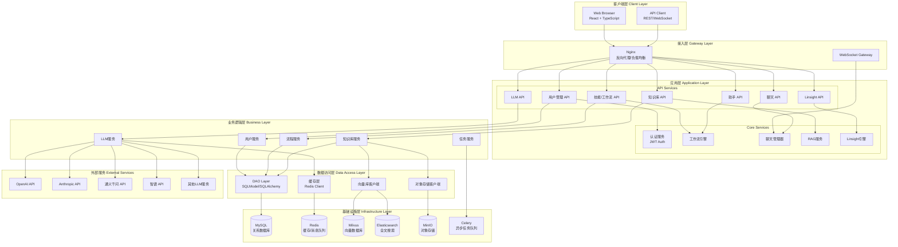
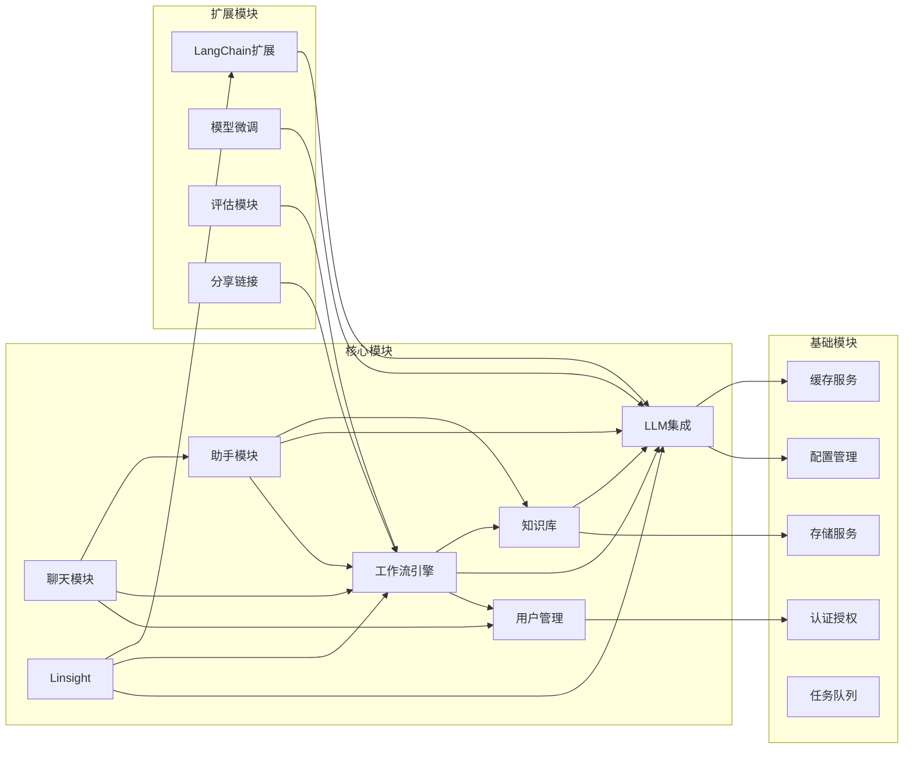
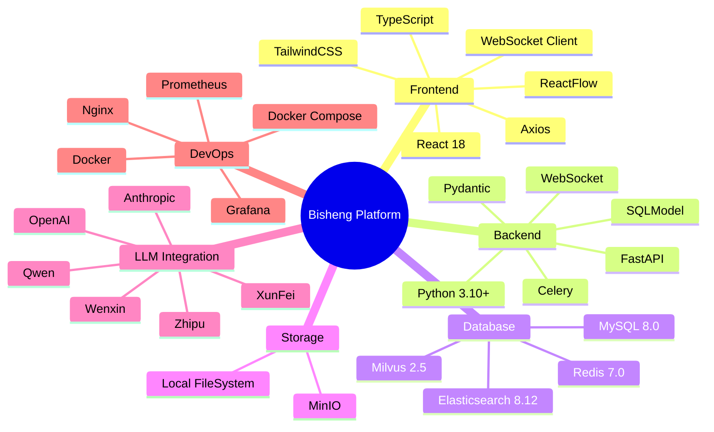
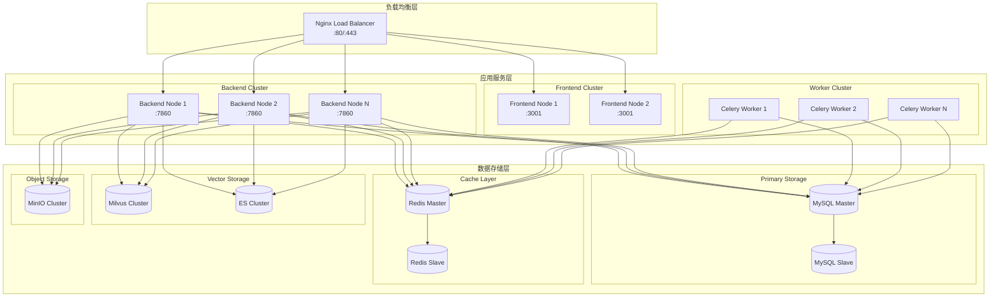
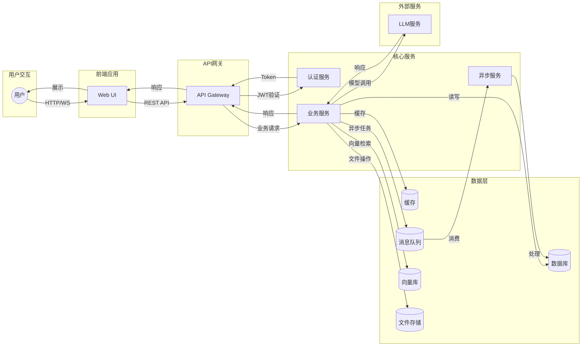
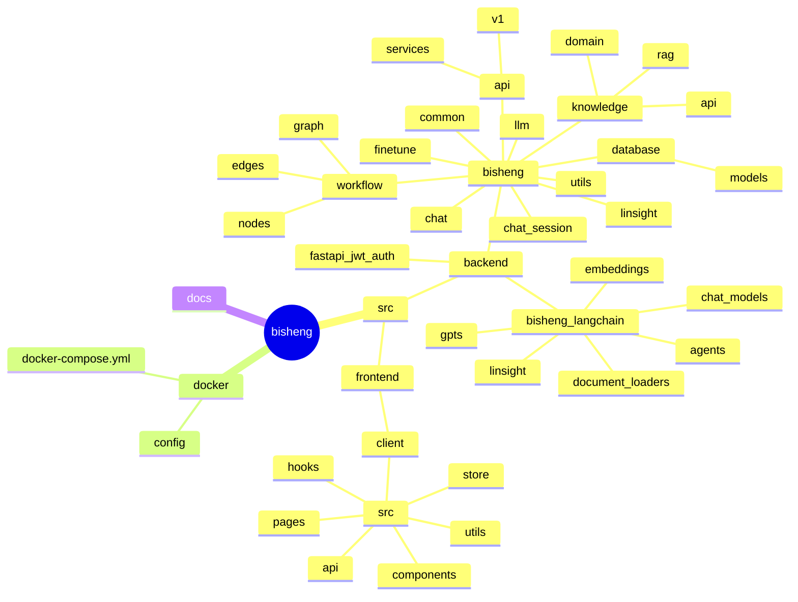
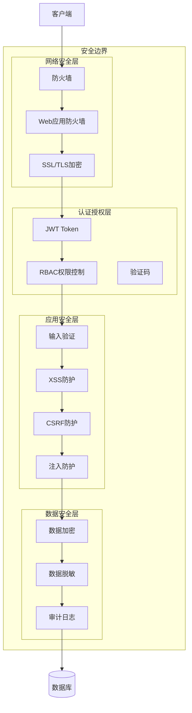

# Bisheng 系统架构图

本文档包含 Bisheng 平台的完整系统架构图、模块关系图和数据流图。

## 1. 整体系统架构图

```mermaid
graph TB
    subgraph "客户端层 Client Layer"
        WEB[Web Browser<br/>React + TypeScript]
        API_CLIENT[API Client<br/>REST/WebSocket]
    end

    subgraph "接入层 Gateway Layer"
        NGINX[Nginx<br/>反向代理/负载均衡]
        WS_GATEWAY[WebSocket Gateway]
    end

    subgraph "应用层 Application Layer"
        subgraph "API Services"
            USER_API[用户管理 API]
            FLOW_API[技能/工作流 API]
            KNOWLEDGE_API[知识库 API]
            CHAT_API[聊天 API]
            LLM_API[LLM API]
            LINSIGHT_API[Linsight API]
            ASSISTANT_API[助手 API]
        end
        
        subgraph "Core Services"
            AUTH_SVC[认证服务<br/>JWT Auth]
            WORKFLOW_ENGINE[工作流引擎]
            CHAT_MANAGER[聊天管理器]
            RAG_SERVICE[RAG服务]
            LINSIGHT_ENGINE[Linsight引擎]
        end
    end

    subgraph "业务逻辑层 Business Layer"
        USER_SVC[用户服务]
        FLOW_SVC[流程服务]
        KNOWLEDGE_SVC[知识库服务]
        LLM_SVC[LLM服务]
        TASK_SVC[任务服务]
    end

    subgraph "数据访问层 Data Access Layer"
        DAO[DAO Layer<br/>SQLModel/SQLAlchemy]
        CACHE[缓存层<br/>Redis Client]
        VECTOR_CLIENT[向量库客户端]
        STORAGE_CLIENT[对象存储客户端]
    end

    subgraph "基础设施层 Infrastructure Layer"
        MYSQL[(MySQL<br/>关系数据库)]
        REDIS[(Redis<br/>缓存/消息队列)]
        MILVUS[(Milvus<br/>向量数据库)]
        ES[(Elasticsearch<br/>全文搜索)]
        MINIO[(MinIO<br/>对象存储)]
        CELERY[Celery<br/>异步任务队列]
    end

    subgraph "外部服务 External Services"
        OPENAI[OpenAI API]
        ANTHROPIC[Anthropic API]
        QWEN[通义千问 API]
        ZHIPU[智谱 API]
        OTHER_LLM[其他LLM服务]
    end

    WEB --> NGINX
    API_CLIENT --> NGINX
    NGINX --> USER_API
    NGINX --> FLOW_API
    NGINX --> KNOWLEDGE_API
    NGINX --> CHAT_API
    NGINX --> LLM_API
    NGINX --> LINSIGHT_API
    NGINX --> ASSISTANT_API
    WS_GATEWAY --> CHAT_MANAGER

    USER_API --> AUTH_SVC
    USER_API --> USER_SVC
    FLOW_API --> WORKFLOW_ENGINE
    FLOW_API --> FLOW_SVC
    KNOWLEDGE_API --> RAG_SERVICE
    KNOWLEDGE_API --> KNOWLEDGE_SVC
    CHAT_API --> CHAT_MANAGER
    LLM_API --> LLM_SVC
    LINSIGHT_API --> LINSIGHT_ENGINE
    ASSISTANT_API --> WORKFLOW_ENGINE

    USER_SVC --> DAO
    FLOW_SVC --> DAO
    KNOWLEDGE_SVC --> DAO
    KNOWLEDGE_SVC --> VECTOR_CLIENT
    KNOWLEDGE_SVC --> STORAGE_CLIENT
    LLM_SVC --> CACHE
    TASK_SVC --> CELERY

    DAO --> MYSQL
    CACHE --> REDIS
    VECTOR_CLIENT --> MILVUS
    VECTOR_CLIENT --> ES
    STORAGE_CLIENT --> MINIO

    LLM_SVC --> OPENAI
    LLM_SVC --> ANTHROPIC
    LLM_SVC --> QWEN
    LLM_SVC --> ZHIPU
    LLM_SVC --> OTHER_LLM
```

## 2. 模块依赖关系图

```mermaid
graph LR
    subgraph "核心模块"
        USER[用户管理]
        WORKFLOW[工作流引擎]
        KNOWLEDGE[知识库]
        CHAT[聊天模块]
        LLM[LLM集成]
        LINSIGHT[Linsight]
        ASSISTANT[助手模块]
    end

    subgraph "基础模块"
        AUTH[认证授权]
        CONFIG[配置管理]
        CACHE[缓存服务]
        STORAGE[存储服务]
        QUEUE[任务队列]
    end

    subgraph "扩展模块"
        LANGCHAIN[LangChain扩展]
        FINETUNE[模型微调]
        EVALUATION[评估模块]
        SHARE[分享链接]
    end

    USER --> AUTH
    WORKFLOW --> USER
    WORKFLOW --> LLM
    WORKFLOW --> KNOWLEDGE
    KNOWLEDGE --> STORAGE
    KNOWLEDGE --> LLM
    CHAT --> USER
    CHAT --> WORKFLOW
    CHAT --> ASSISTANT
    LLM --> CONFIG
    LLM --> CACHE
    LINSIGHT --> LLM
    LINSIGHT --> WORKFLOW
    LINSIGHT --> LANGCHAIN
    ASSISTANT --> WORKFLOW
    ASSISTANT --> LLM
    ASSISTANT --> KNOWLEDGE

    LANGCHAIN --> LLM
    FINETUNE --> LLM
    EVALUATION --> WORKFLOW
    SHARE --> WORKFLOW
```

## 3. 技术栈全景图

```mermaid
mindmap
    root((Bisheng Platform))
        Frontend
            React 18
            TypeScript
            TailwindCSS
            ReactFlow
            WebSocket Client
            Axios
        Backend
            FastAPI
            Python 3.10+
            SQLModel
            Pydantic
            Celery
            WebSocket
        Database
            MySQL 8.0
            Redis 7.0
            Milvus 2.5
            Elasticsearch 8.12
        Storage
            MinIO
            Local FileSystem
        LLM Integration
            OpenAI
            Anthropic
            Qwen
            Zhipu
            Wenxin
            XunFei
        DevOps
            Docker
            Docker Compose
            Nginx
            Prometheus
            Grafana
```

## 4. 部署架构图

```mermaid
graph TB
    subgraph "负载均衡层"
        LB[Nginx Load Balancer<br/>:80/:443]
    end

    subgraph "应用服务层"
        subgraph "Backend Cluster"
            BE1[Backend Node 1<br/>:7860]
            BE2[Backend Node 2<br/>:7860]
            BE3[Backend Node N<br/>:7860]
        end
        
        subgraph "Frontend Cluster"
            FE1[Frontend Node 1<br/>:3001]
            FE2[Frontend Node 2<br/>:3001]
        end

        subgraph "Worker Cluster"
            W1[Celery Worker 1]
            W2[Celery Worker 2]
            W3[Celery Worker N]
        end
    end

    subgraph "数据存储层"
        subgraph "Primary Storage"
            MYSQL_M[(MySQL Master)]
            MYSQL_S[(MySQL Slave)]
        end
        
        subgraph "Cache Layer"
            REDIS_M[(Redis Master)]
            REDIS_S[(Redis Slave)]
        end

        subgraph "Vector Storage"
            MILVUS[(Milvus Cluster)]
            ES[(ES Cluster)]
        end

        subgraph "Object Storage"
            MINIO[(MinIO Cluster)]
        end
    end

    LB --> BE1
    LB --> BE2
    LB --> BE3
    LB --> FE1
    LB --> FE2

    BE1 --> MYSQL_M
    BE2 --> MYSQL_M
    BE3 --> MYSQL_M
    MYSQL_M --> MYSQL_S

    BE1 --> REDIS_M
    BE2 --> REDIS_M
    BE3 --> REDIS_M
    REDIS_M --> REDIS_S

    BE1 --> MILVUS
    BE2 --> MILVUS
    BE3 --> MILVUS

    BE1 --> ES
    BE2 --> ES
    BE3 --> ES

    BE1 --> MINIO
    BE2 --> MINIO
    BE3 --> MINIO

    W1 --> REDIS_M
    W2 --> REDIS_M
    W3 --> REDIS_M
    W1 --> MYSQL_M
    W2 --> MYSQL_M
    W3 --> MYSQL_M
```

## 5. 数据流向图

```mermaid
flowchart LR
    subgraph "用户交互"
        USER((用户))
    end

    subgraph "前端应用"
        UI[Web UI]
    end

    subgraph "API网关"
        GW[API Gateway]
    end

    subgraph "核心服务"
        AUTH[认证服务]
        BIZ[业务服务]
        ASYNC[异步服务]
    end

    subgraph "数据层"
        DB[(数据库)]
        CACHE[(缓存)]
        QUEUE[(消息队列)]
        VECTOR[(向量库)]
        FILE[(文件存储)]
    end

    subgraph "外部服务"
        LLM[LLM服务]
    end

    USER -->|HTTP/WS| UI
    UI -->|REST API| GW
    GW -->|JWT验证| AUTH
    AUTH -->|Token| GW
    GW -->|业务请求| BIZ
    BIZ -->|读写| DB
    BIZ -->|缓存| CACHE
    BIZ -->|异步任务| QUEUE
    QUEUE -->|消费| ASYNC
    ASYNC -->|处理| DB
    BIZ -->|向量检索| VECTOR
    BIZ -->|文件操作| FILE
    BIZ -->|模型调用| LLM
    LLM -->|响应| BIZ
    BIZ -->|响应| GW
    GW -->|响应| UI
    UI -->|展示| USER
```

## 6. 代码目录结构脑图

```mermaid
mindmap
    root((bisheng))
        src
            backend
                bisheng
                    api
                        v1
                        services
                    chat
                    chat_session
                    database
                        models
                    knowledge
                        api
                        domain
                        rag
                    linsight
                    llm
                    workflow
                        nodes
                        graph
                        edges
                    finetune
                    common
                    utils
                bisheng_langchain
                    chat_models
                    embeddings
                    document_loaders
                    gpts
                    linsight
                    agents
                fastapi_jwt_auth
            frontend
                client
                    src
                        components
                        hooks
                        pages
                        store
                        api
                        utils
        docker
            docker-compose.yml
            config
        docs
```

## 7. 安全架构图

```mermaid
graph TB
    subgraph "安全边界"
        subgraph "网络安全层"
            FW[防火墙]
            WAF[Web应用防火墙]
            SSL[SSL/TLS加密]
        end

        subgraph "认证授权层"
            JWT[JWT Token]
            RBAC[RBAC权限控制]
            CAPTCHA[验证码]
        end

        subgraph "数据安全层"
            ENCRYPT[数据加密]
            MASK[数据脱敏]
            AUDIT[审计日志]
        end

        subgraph "应用安全层"
            INPUT[输入验证]
            XSS[XSS防护]
            CSRF[CSRF防护]
            INJECTION[注入防护]
        end
    end

    CLIENT[客户端] --> FW
    FW --> WAF
    WAF --> SSL
    SSL --> JWT
    JWT --> RBAC
    RBAC --> INPUT
    INPUT --> XSS
    XSS --> CSRF
    CSRF --> INJECTION
    INJECTION --> ENCRYPT
    ENCRYPT --> MASK
    MASK --> AUDIT
    AUDIT --> DB[(数据库)]
```
