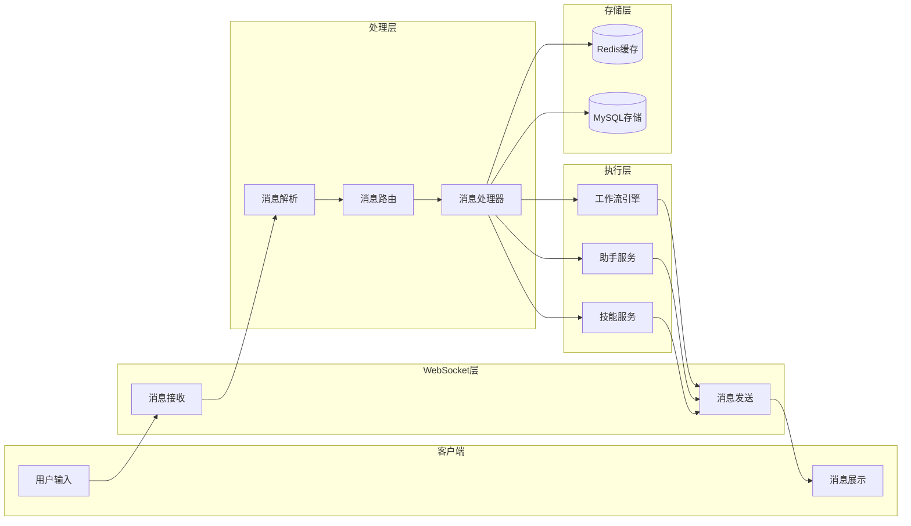

# 消息流转数据流图

展示聊天消息在系统中的流转过程。

## 代码入口

| 类/函数 | 文件路径 | 说明 |
|---------|----------|------|
| `ChatManager` | `src/backend/bisheng/chat/manager.py` | 消息管理 |
| `ChatHistory` | `src/backend/bisheng/chat/manager.py:39` | 历史记录管理 |
| `ChatMessage` | `src/backend/bisheng/api/v1/schemas.py` | 消息模型 |
| `ChatMessageDao` | `src/backend/bisheng/database/models/message.py` | 消息数据访问 |
| `MessageSessionDao` | `src/backend/bisheng/database/models/session.py` | 会话数据访问 |

## 数据流说明

### 消息流入

| 阶段 | 说明 |
|------|------|
| 用户输入 | 用户在界面输入消息 |
| 消息接收 | WebSocket接收消息 |
| 消息解析 | 解析JSON格式 |
| 消息路由 | 根据类型路由 |
| 消息处理 | 执行业务逻辑 |

### 消息流出

| 阶段 | 说明 |
|------|------|
| 执行结果 | 业务执行返回结果 |
| 消息发送 | WebSocket发送消息 |
| 消息展示 | 界面展示消息 |

### 数据存储

| 存储 | 用途 |
|------|------|
| Redis | 会话状态、临时数据 |
| MySQL | 消息记录、会话历史 |
