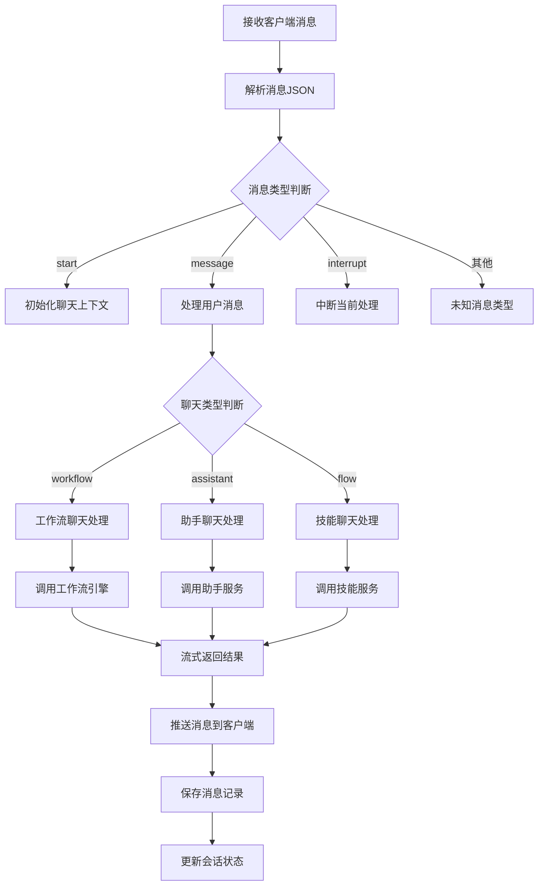

# 消息处理流程图

展示聊天消息的接收和处理流程。

## 代码入口

| 类/函数 | 文件路径 | 说明 |
|---------|----------|------|
| `Handler` | `src/backend/bisheng/chat/handlers.py` | 消息处理器核心类 |
| `Handler.dispatch_task()` | `src/backend/bisheng/chat/handlers.py:41` | 消息分发入口 |
| `Handler.process_message()` | `src/backend/bisheng/chat/handlers.py:201` | 处理普通消息 |
| `Handler.process_file()` | `src/backend/bisheng/chat/handlers.py:313` | 处理文件消息 |
| `Handler.process_autogen()` | `src/backend/bisheng/chat/handlers.py:373` | 处理AutoGen消息 |
| `Handler.process_stop()` | `src/backend/bisheng/chat/handlers.py:59` | 处理停止消息 |
| `WorkType` | `src/backend/bisheng/chat/types.py` | 聊天业务类型枚举 |



## 消息说明

### 消息类型

| 类型 | 说明 |
|------|------|
| start | 开始聊天 |
| message | 普通消息 |
| interrupt | 中断处理 |
| progress | 处理进度 |
| result | 处理结果 |
| error | 错误信息 |
| end | 结束聊天 |

### 聊天类型

| 类型 | 说明 |
|------|------|
| workflow | 工作流聊天 |
| assistant | 助手聊天 |
| flow | 技能聊天 |
| linsight | Linsight聊天 |

### 消息格式

```json
{
  "type": "message",
  "data": {
    "input": "用户输入内容"
  },
  "trace_id": "追踪ID"
}
```
