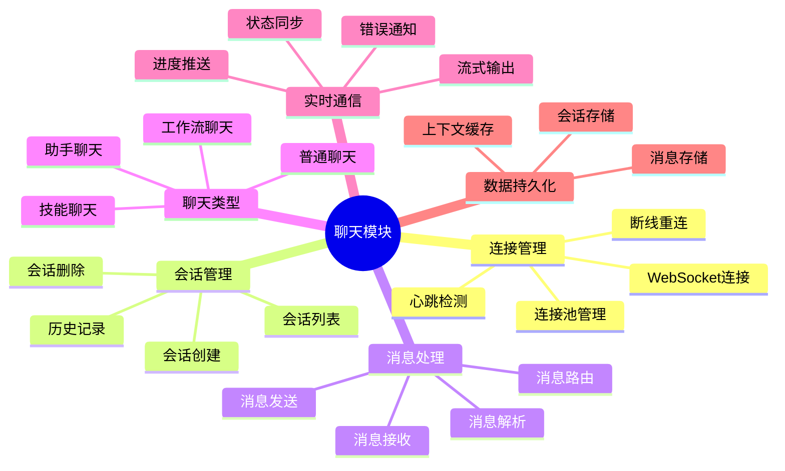

# 聊天模块脑图

展示聊天模块的功能结构。

## 代码入口

| 类/函数 | 文件路径 | 说明 |
|---------|----------|------|
| `chat/` | `src/backend/bisheng/chat/` | 聊天模块目录 |
| `ChatManager` | `src/backend/bisheng/chat/manager.py` | 连接和会话管理 |
| `Handler` | `src/backend/bisheng/chat/handlers.py` | 消息处理器 |
| `ChatClient` | `src/backend/bisheng/chat/client.py` | 聊天客户端 |
| `WorkflowClient` | `src/backend/bisheng/chat/clients/workflow_client.py` | 工作流客户端 |
| `WorkType` | `src/backend/bisheng/chat/types.py` | 业务类型枚举 |
| `chat.py` | `src/backend/bisheng/api/v1/chat.py` | API路由入口 |
| `ChatMessageDao` | `src/backend/bisheng/database/models/message.py` | 消息数据访问 |

## 功能说明

### 连接管理
- **WebSocket连接**: 建立双向通信
- **连接池管理**: 管理多个连接
- **心跳检测**: 保持连接活性
- **断线重连**: 自动重新连接

### 会话管理
- **会话创建**: 创建新的聊天会话
- **会话列表**: 查看历史会话
- **会话删除**: 删除不需要的会话
- **历史记录**: 查看聊天历史

### 聊天类型
- **工作流聊天**: 与工作流交互
- **助手聊天**: 与AI助手交互
- **技能聊天**: 与技能交互
- **普通聊天**: 基础文本聊天
