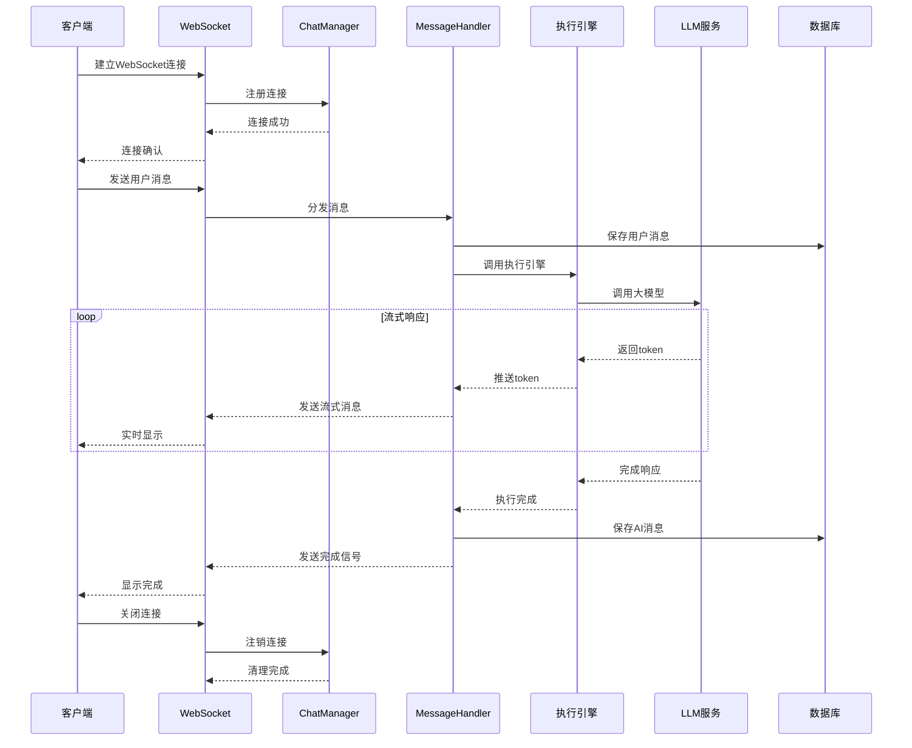

# 聊天会话时序图

展示聊天会话中各组件的交互时序。

## 代码入口

| 类/函数 | 文件路径 | 说明 |
|---------|----------|------|
| `ChatManager` | `src/backend/bisheng/chat/manager.py:80` | 聊天管理器 |
| `ChatHistory` | `src/backend/bisheng/chat/manager.py:39` | 聊天历史管理 |
| `ChatHistory.add_message()` | `src/backend/bisheng/chat/manager.py:45` | 添加消息记录 |
| `ChatManager.send_json()` | `src/backend/bisheng/chat/manager.py:130` | 发送JSON消息 |
| `process_graph()` | `src/backend/bisheng/chat/utils.py` | 执行图处理 |
| `ChatMessage` | `src/backend/bisheng/api/v1/schemas.py` | 消息数据模型 |
| `ChatResponse` | `src/backend/bisheng/api/v1/schemas.py` | 响应数据模型 |

## 时序说明

### 参与组件

| 组件 | 职责 |
|------|------|
| 客户端 | 发送消息，接收响应 |
| WebSocket | 双向通信通道 |
| ChatManager | 连接管理 |
| MessageHandler | 消息处理 |
| 执行引擎 | 业务执行 |
| LLM服务 | 模型调用 |
| 数据库 | 消息持久化 |

### 流式响应

- LLM逐token返回结果
- 实时推送到客户端
- 用户可以看到打字效果
