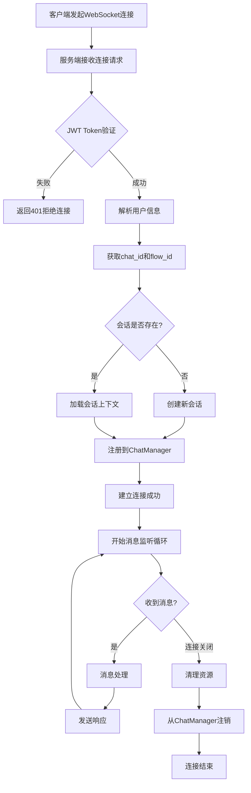

# WebSocket连接流程图

展示WebSocket连接建立和管理的流程。

## 代码入口

| 类/函数 | 文件路径 | 说明 |
|---------|----------|------|
| `ChatManager` | `src/backend/bisheng/chat/manager.py` | 连接管理核心类 |
| `ChatManager.connect()` | `src/backend/bisheng/chat/manager.py:109` | 建立WebSocket连接 |
| `ChatManager.handle_websocket()` | `src/backend/bisheng/chat/manager.py:264` | WebSocket消息处理主循环 |
| `ChatManager.dispatch_client()` | `src/backend/bisheng/chat/manager.py:198` | 客户端消息分发 |
| `union_websocket()` | `src/backend/bisheng/api/v1/chat.py:490` | WebSocket路由入口 |
| `ChatClient` | `src/backend/bisheng/chat/client.py` | 聊天客户端封装 |
| `WorkflowClient` | `src/backend/bisheng/chat/clients/workflow_client.py` | 工作流聊天客户端 |



## 连接说明

### 连接地址

```
ws://host:port/chat/{flow_id}?chat_id={chat_id}
Headers: Authorization: Bearer {jwt_token}
```

### 连接生命周期

| 阶段 | 说明 |
|------|------|
| 连接建立 | 验证身份，初始化会话 |
| 消息交换 | 双向实时消息传输 |
| 心跳维持 | 定期发送心跳包 |
| 连接关闭 | 清理资源，注销连接 |

### ChatManager职责

- 管理所有活跃连接
- 连接注册和注销
- 消息路由和分发
- 心跳检测和超时处理
