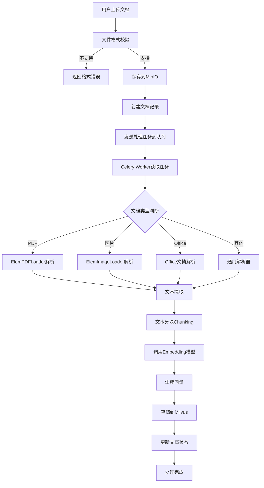

# 文档处理流程图

展示文档从上传到向量化的完整处理流程。

## 代码入口

| 类/函数 | 文件路径 | 说明 |
|---------|----------|------|
| `upload_file()` | `src/backend/bisheng/knowledge/api/endpoints/knowledge.py:46` | 文件上传API |
| `KnowledgeService.process_knowledge_file()` | `src/backend/bisheng/api/services/knowledge.py:523` | 文件处理入口 |
| `process_file_task()` | `src/backend/bisheng/api/services/knowledge_imp.py:243` | 文件处理任务 |
| `addEmbedding()` | `src/backend/bisheng/api/services/knowledge_imp.py:421` | 向量入库 |
| `add_file_embedding()` | `src/backend/bisheng/api/services/knowledge_imp.py:500` | 单文件向量化 |
| `read_chunk_text()` | `src/backend/bisheng/api/services/knowledge_imp.py` | 文本分块 |
| `KnowledgeFileDao` | `src/backend/bisheng/knowledge/domain/models/knowledge_file.py` | 文件数据访问 |
| `parse_knowledge_file_celery` | `src/backend/bisheng/worker/knowledge/` | Celery异步任务 |

## 处理说明

### 支持的文档格式

| 类型 | 格式 |
|------|------|
| 文本 | txt, md |
| 办公 | doc, docx, xls, xlsx, ppt, pptx |
| PDF | pdf |
| 图片 | png, jpg, jpeg, bmp, tiff |
| 数据 | csv, html |

### 处理阶段

1. **上传阶段** - 文件上传和格式校验
2. **存储阶段** - 保存到MinIO对象存储
3. **解析阶段** - 根据类型选择解析器
4. **分块阶段** - 文本分块处理
5. **向量化阶段** - 生成向量嵌入
6. **索引阶段** - 存储到向量数据库

### 文档状态

| 状态 | 值 | 说明 |
|------|-----|------|
| 待处理 | 1 | 等待处理 |
| 处理中 | 2 | 正在处理 |
| 已完成 | 3 | 处理完成 |
| 错误 | 4 | 处理失败 |
