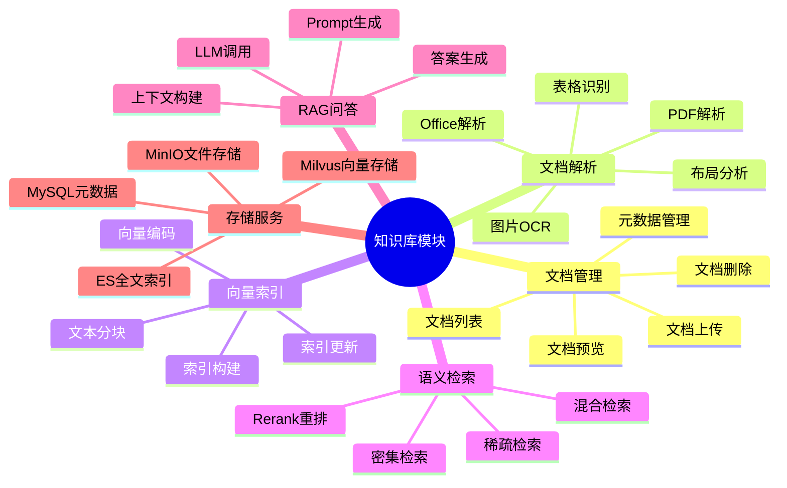

# 知识库模块脑图

展示知识库模块的功能结构。

## 代码入口

| 类/函数 | 文件路径 | 说明 |
|---------|----------|------|
| `knowledge/` | `src/backend/bisheng/knowledge/` | 知识库模块目录 |
| `KnowledgeService` | `src/backend/bisheng/api/services/knowledge.py` | 知识库服务类 |
| `KnowledgeRag` | `src/backend/bisheng/knowledge/domain/knowledge_rag.py` | RAG核心类 |
| `KnowledgeDao` | `src/backend/bisheng/knowledge/domain/models/knowledge.py` | 知识库数据访问 |
| `KnowledgeFileDao` | `src/backend/bisheng/knowledge/domain/models/knowledge_file.py` | 文件数据访问 |
| `KnowledgeUtils` | `src/backend/bisheng/api/services/knowledge_imp.py:76` | 知识库工具类 |
| `knowledge.py` | `src/backend/bisheng/knowledge/api/endpoints/knowledge.py` | API路由入口 |
| `file_worker` | `src/backend/bisheng/worker/knowledge/` | Celery异步任务 |

## 功能说明

### 文档管理
- **文档上传**: 支持多种格式文档上传
- **文档列表**: 查看知识库中的文档
- **文档删除**: 删除不需要的文档
- **元数据管理**: 管理文档的元数据字段

### 文档解析
- **PDF解析**: 高精度PDF内容提取
- **图片OCR**: 图片文字识别
- **Office解析**: Word/Excel/PPT解析
- **表格识别**: 表格结构识别

### 语义检索
- **密集检索**: 基于向量相似度
- **稀疏检索**: 基于关键词匹配
- **混合检索**: 两种方式结合
- **Rerank重排**: 结果重新排序
