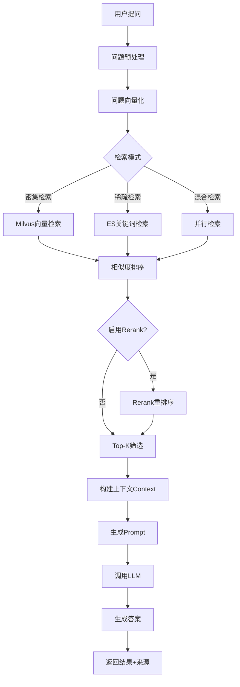

# RAG检索流程图

展示RAG检索增强生成的完整流程。

## 代码入口

| 类/函数 | 文件路径 | 说明 |
|---------|----------|------|
| `KnowledgeRag` | `src/backend/bisheng/knowledge/domain/knowledge_rag.py` | RAG核心类 |
| `KnowledgeRag.init_knowledge_milvus_vectorstore()` | `src/backend/bisheng/knowledge/domain/knowledge_rag.py:35` | Milvus向量库初始化 |
| `KnowledgeRag.init_knowledge_es_vectorstore()` | `src/backend/bisheng/knowledge/domain/knowledge_rag.py:49` | ES向量库初始化 |
| `MilvusFactory` | `src/backend/bisheng/knowledge/rag/milvus_factory.py` | Milvus工厂类 |
| `ElasticsearchFactory` | `src/backend/bisheng/knowledge/rag/elasticsearch_factory.py` | ES工厂类 |
| `KnowledgeService.get_knowledge_chunks()` | `src/backend/bisheng/api/services/knowledge.py:915` | 获取知识分块 |
| `RagNode` | `src/backend/bisheng/workflow/nodes/rag/rag.py` | 工作流RAG节点 |



## 检索说明

### 检索模式

| 模式 | 说明 | 适用场景 |
|------|------|----------|
| 密集检索 | 基于向量相似度 | 语义理解 |
| 稀疏检索 | 基于关键词匹配 | 精确匹配 |
| 混合检索 | 两者结合 | 综合场景 |

### 检索参数

```yaml
knowledge:
  chunk_size: 1000              # 分块大小
  chunk_overlap: 200            # 分块重叠
  similarity_threshold: 0.8     # 相似度阈值
  max_search_results: 10        # 最大结果数
```

### Rerank重排序

- 使用交叉编码器对初步结果重新排序
- 提高检索结果的相关性
- 可配置是否启用

### Prompt构建

```
基于以下内容回答问题：{question}

参考内容：
{context}

请给出准确的回答。
```
