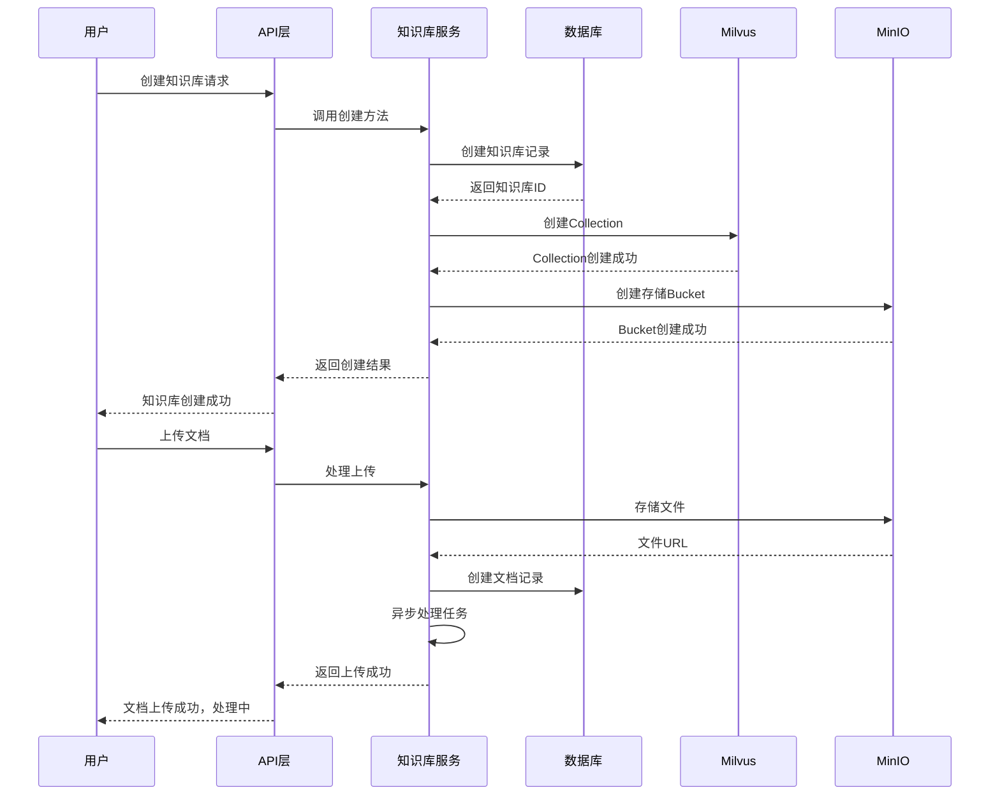

# 知识库创建时序图

展示知识库创建和文档上传过程中各组件的交互时序。

## 代码入口

| 类/函数 | 文件路径 | 说明 |
|---------|----------|------|
| `KnowledgeDao` | `src/backend/bisheng/knowledge/domain/models/knowledge.py` | 知识库数据访问 |
| `KnowledgeFileDao` | `src/backend/bisheng/knowledge/domain/models/knowledge_file.py` | 文件数据访问 |
| `KnowledgeService` | `src/backend/bisheng/api/services/knowledge.py` | 知识库服务 |
| `KnowledgeRag` | `src/backend/bisheng/knowledge/domain/knowledge_rag.py` | RAG初始化 |
| `knowledge.py` | `src/backend/bisheng/knowledge/api/endpoints/knowledge.py` | API路由 |

## 时序说明

### 知识库创建

1. 用户发起创建请求
2. 创建数据库记录
3. 创建Milvus Collection
4. 创建MinIO Bucket
5. 返回创建结果

### 文档上传

1. 用户上传文档
2. 存储文件到MinIO
3. 创建文档记录
4. 发送异步处理任务
5. 返回上传成功

### 涉及组件

| 组件 | 职责 |
|------|------|
| 数据库 | 存储知识库和文档元数据 |
| Milvus | 存储文档向量 |
| MinIO | 存储原始文档文件 |
| Celery | 异步处理文档 |
