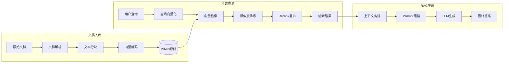

# 向量检索数据流图

展示知识库向量检索的数据流转过程。

## 代码入口

| 类/函数 | 文件路径 | 说明 |
|---------|----------|------|
| `KnowledgeRag` | `src/backend/bisheng/knowledge/domain/knowledge_rag.py` | RAG核心类 |
| `MilvusFactory` | `src/backend/bisheng/knowledge/rag/milvus_factory.py` | Milvus工厂 |
| `ElasticsearchFactory` | `src/backend/bisheng/knowledge/rag/elasticsearch_factory.py` | ES工厂 |
| `decide_embeddings()` | `src/backend/bisheng/utils/embedding.py` | Embedding选择 |
| `addEmbedding()` | `src/backend/bisheng/api/services/knowledge_imp.py:421` | 向量入库 |

## 数据流说明

### 文档入库流程

| 阶段 | 输入 | 输出 |
|------|------|------|
| 文档解析 | 原始文件 | 纯文本 |
| 文本分块 | 纯文本 | 文本块列表 |
| 向量编码 | 文本块 | 向量列表 |
| 向量存储 | 向量 | 索引ID |

### 检索查询流程

| 阶段 | 输入 | 输出 |
|------|------|------|
| 查询向量化 | 查询文本 | 查询向量 |
| 向量检索 | 查询向量 | 候选文档 |
| 相似度排序 | 候选文档 | 排序结果 |
| Rerank重排 | 排序结果 | 最终排序 |

### RAG生成流程

| 阶段 | 输入 | 输出 |
|------|------|------|
| 上下文构建 | 检索结果 | 上下文文本 |
| Prompt组装 | 问题+上下文 | 完整Prompt |
| LLM生成 | Prompt | 答案文本 |
