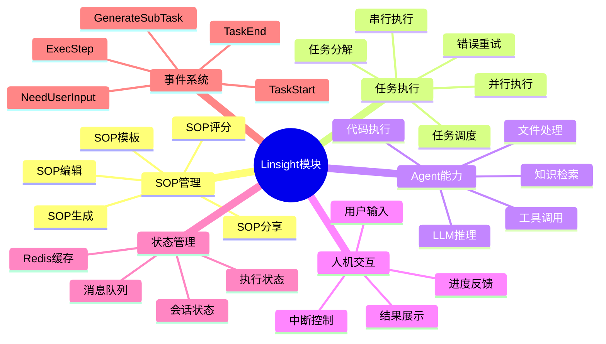

# Linsight模块脑图

展示Linsight模块的功能结构。

## 代码入口

| 类/函数 | 文件路径 | 说明 |
|---------|----------|------|
| `linsight/` | `src/backend/bisheng/linsight/` | Linsight模块目录 |
| `LinsightWorkflowTask` | `src/backend/bisheng/linsight/task_exec.py` | 任务执行器 |
| `LinsightStateMessageManager` | `src/backend/bisheng/linsight/state_message_manager.py` | 状态管理 |
| `SOPManageService` | `src/backend/bisheng/api/services/linsight/sop_manage.py` | SOP管理 |
| `LinsightWorkbenchImpl` | `src/backend/bisheng/api/services/linsight/workbench_impl.py` | 工作台实现 |
| `LinsightAgent` | `src/backend/bisheng_langchain/linsight/agent.py` | Agent实现 |
| `linsight.py` | `src/backend/bisheng/api/v1/linsight.py` | API路由 |
| `LinsightSessionVersionDao` | `src/backend/bisheng/database/models/linsight_session_version.py` | 会话数据 |
| `LinsightExecuteTaskDao` | `src/backend/bisheng/database/models/linsight_execute_task.py` | 任务数据 |

## 功能说明

### SOP管理
- **SOP生成**: LLM自动生成执行计划
- **SOP编辑**: 用户可修改SOP
- **SOP模板**: 复用常用SOP
- **SOP评分**: 用户对SOP评分
- **SOP分享**: 分享优质SOP

### 任务执行
- **任务分解**: 将SOP分解为子任务
- **任务调度**: 调度任务执行顺序
- **并行执行**: 支持并行任务
- **串行执行**: 支持串行任务
- **错误重试**: 失败任务重试

### Agent能力
- **LLM推理**: 调用大模型推理
- **工具调用**: 调用各种工具
- **知识检索**: 检索知识库
- **代码执行**: 执行Python代码
- **文件处理**: 处理文件

### 事件系统
- **TaskStart**: 任务开始事件
- **TaskEnd**: 任务结束事件
- **ExecStep**: 执行步骤事件
- **NeedUserInput**: 需要用户输入
- **GenerateSubTask**: 生成子任务
