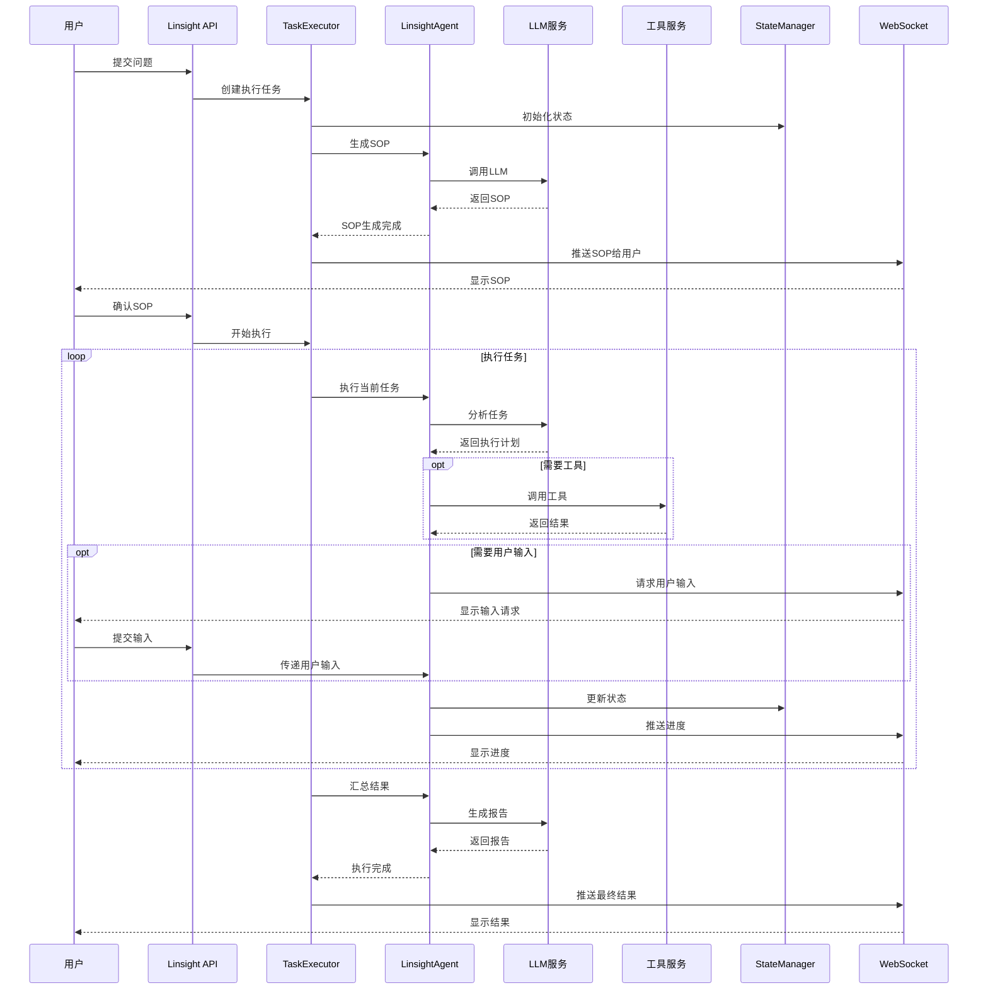

# Linsight执行时序图

展示Linsight执行过程中各组件的交互时序。

## 代码入口

| 类/函数 | 文件路径 | 说明 |
|---------|----------|------|
| `LinsightWorkflowTask` | `src/backend/bisheng/linsight/task_exec.py` | 任务执行器 |
| `LinsightStateMessageManager` | `src/backend/bisheng/linsight/state_message_manager.py` | 状态消息管理 |
| `MessageStreamHandle` | `src/backend/bisheng/api/services/linsight/message_stream_handle.py` | 消息流处理 |
| `LinsightAgent` | `src/backend/bisheng_langchain/linsight/agent.py` | Agent执行 |
| `ToolServices` | `src/backend/bisheng/api/services/tool.py` | 工具服务 |
| `LinsightSessionVersionDao` | `src/backend/bisheng/database/models/linsight_session_version.py` | 会话版本数据 |
| `worker.py` | `src/backend/bisheng/linsight/worker.py` | 后台Worker |

## 时序说明

### 参与组件

| 组件 | 职责 |
|------|------|
| 用户 | 提交问题，确认SOP，提供输入 |
| Linsight API | 接收请求，返回响应 |
| TaskExecutor | 任务执行调度 |
| LinsightAgent | 智能代理执行 |
| LLM服务 | 大模型调用 |
| 工具服务 | 工具调用 |
| StateManager | 状态管理 |
| WebSocket | 实时消息推送 |

### 交互特点

- SOP生成后需用户确认
- 执行中可请求用户输入
- 实时推送执行进度
- 最终生成执行报告
