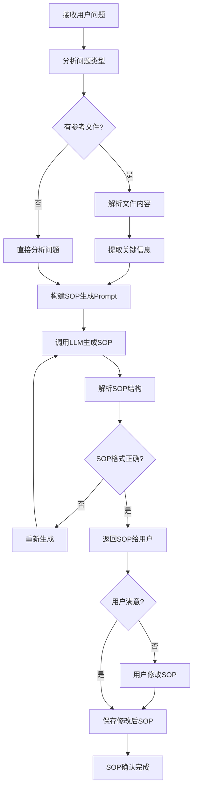

# SOP生成流程图

展示SOP（标准操作流程）的生成流程。

## 代码入口

| 类/函数 | 文件路径 | 说明 |
|---------|----------|------|
| `SOPManageService` | `src/backend/bisheng/api/services/linsight/sop_manage.py` | SOP管理服务 |
| `LinsightSOPDao` | `src/backend/bisheng/database/models/linsight_sop.py` | SOP数据访问 |
| `LinsightSOPRecord` | `src/backend/bisheng/database/models/linsight_sop.py` | SOP记录模型 |
| `LinsightWorkbenchImpl` | `src/backend/bisheng/api/services/linsight/workbench_impl.py` | 工作台实现 |
| `linsight_execute_utils` | `src/backend/bisheng/linsight/utils.py` | 执行工具函数 |



## SOP说明

### SOP结构

```json
{
  "title": "SOP标题",
  "description": "SOP描述",
  "steps": [
    {
      "step_id": 1,
      "name": "步骤名称",
      "description": "步骤描述",
      "tools": ["tool1", "tool2"],
      "expected_output": "预期输出"
    }
  ]
}
```

### 生成要点

| 要点 | 说明 |
|------|------|
| 步骤清晰 | 每步目标明确 |
| 逻辑连贯 | 步骤间有逻辑关系 |
| 可执行 | 每步可被Agent执行 |
| 可验证 | 有明确的完成标准 |

### 用户交互

- 用户可查看生成的SOP
- 用户可修改SOP内容
- 用户确认后开始执行
- 支持SOP模板复用
