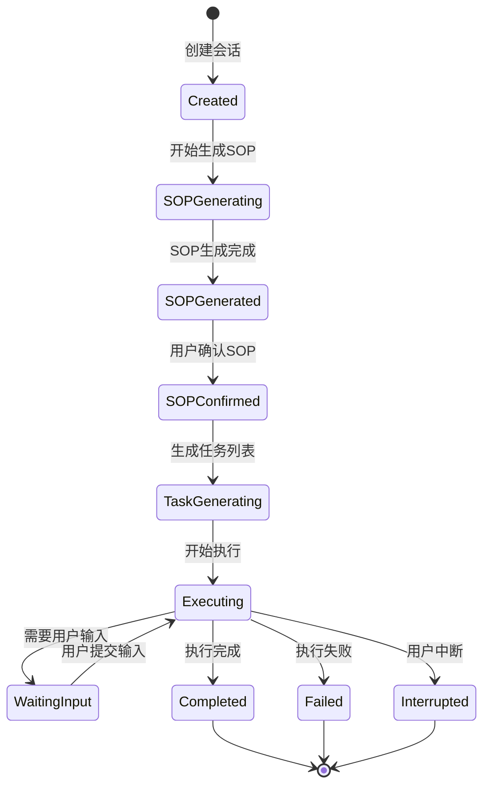

# 状态流转图

展示Linsight会话的状态流转。

## 代码入口

| 类/函数 | 文件路径 | 说明 |
|---------|----------|------|
| `SessionVersionStatusEnum` | `src/backend/bisheng/database/models/linsight_session_version.py` | 会话状态枚举 |
| `ExecuteTaskStatusEnum` | `src/backend/bisheng/database/models/linsight_execute_task.py` | 任务状态枚举 |
| `LinsightSessionVersion` | `src/backend/bisheng/database/models/linsight_session_version.py` | 会话版本模型 |
| `LinsightExecuteTask` | `src/backend/bisheng/database/models/linsight_execute_task.py` | 执行任务模型 |
| `LinsightStateMessageManager` | `src/backend/bisheng/linsight/state_message_manager.py` | 状态消息管理 |
| `MessageEventType` | `src/backend/bisheng/linsight/state_message_manager.py` | 消息事件类型 |

## 状态说明

### 状态定义

| 状态 | 说明 |
|------|------|
| Created | 会话已创建 |
| SOPGenerating | 正在生成SOP |
| SOPGenerated | SOP生成完成 |
| SOPConfirmed | 用户已确认SOP |
| TaskGenerating | 正在生成任务 |
| Executing | 正在执行任务 |
| WaitingInput | 等待用户输入 |
| Completed | 执行完成 |
| Failed | 执行失败 |
| Interrupted | 用户中断 |

### 状态转换

| 从状态 | 到状态 | 触发条件 |
|--------|--------|----------|
| Created | SOPGenerating | 开始生成SOP |
| SOPGenerating | SOPGenerated | SOP生成完成 |
| SOPGenerated | SOPConfirmed | 用户确认 |
| Executing | WaitingInput | 需要用户输入 |
| WaitingInput | Executing | 用户提交输入 |
| Executing | Completed | 所有任务完成 |
| Executing | Failed | 执行出错 |
| Executing | Interrupted | 用户中断 |

### 状态持久化

- 状态存储在数据库
- Redis缓存当前状态
- 支持状态恢复
