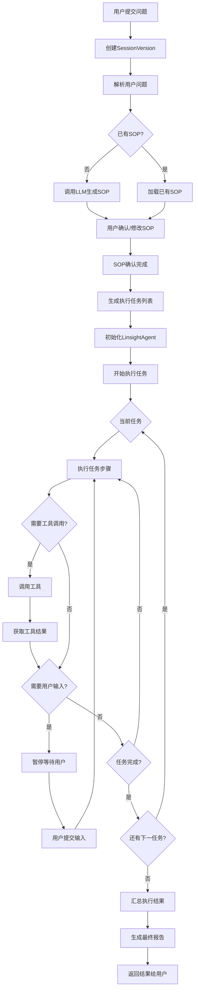

# Linsight任务执行流程图

展示Linsight任务从提交到完成的执行流程。

## 代码入口

| 类/函数 | 文件路径 | 说明 |
|---------|----------|------|
| `LinsightWorkflowTask` | `src/backend/bisheng/linsight/task_exec.py:49` | 任务执行器核心类 |
| `LinsightWorkflowTask._managed_execution()` | `src/backend/bisheng/linsight/task_exec.py:66` | 执行资源管理 |
| `LinsightStateMessageManager` | `src/backend/bisheng/linsight/state_message_manager.py` | 状态消息管理 |
| `LinsightWorkbenchImpl` | `src/backend/bisheng/api/services/linsight/workbench_impl.py` | 工作台实现 |
| `LinsightAgent` | `src/backend/bisheng_langchain/linsight/agent.py` | Linsight Agent |
| `linsight.py` | `src/backend/bisheng/api/v1/linsight.py:45` | API路由入口 |
| `LinsightExecuteTaskDao` | `src/backend/bisheng/database/models/linsight_execute_task.py` | 任务数据访问 |

## 执行说明

### 执行阶段

| 阶段 | 说明 |
|------|------|
| 问题解析 | 理解用户意图 |
| SOP生成 | 生成执行计划 |
| 任务分解 | 分解为子任务 |
| 任务执行 | 逐个执行任务 |
| 结果汇总 | 汇总执行结果 |

### 人机交互

- 用户可修改SOP
- 执行中可请求用户输入
- 支持中断和恢复

### 工具调用

- 代码解释器
- 知识库检索
- 文件处理
- 自定义工具
