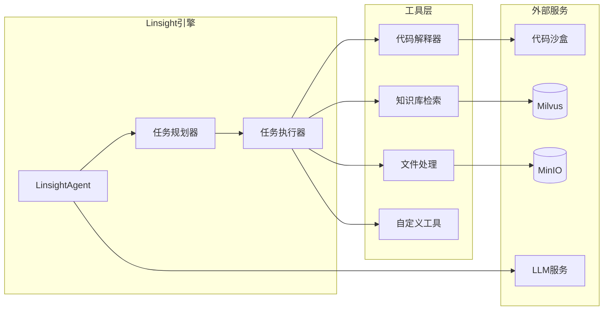

# 工具调用数据流图

展示Linsight工具调用的数据流转过程。

## 代码入口

| 类/函数 | 文件路径 | 说明 |
|---------|----------|------|
| `ToolServices` | `src/backend/bisheng/api/services/tool.py` | 工具服务 |
| `LinsightAgent` | `src/backend/bisheng_langchain/linsight/agent.py` | Agent执行 |
| `LinsightWorkflowTask` | `src/backend/bisheng/linsight/task_exec.py` | 任务执行器 |
| `tool.py` | `src/backend/bisheng/api/v1/tool.py` | 工具API路由 |
| `tool/` | `src/backend/bisheng/api/services/tool/` | 工具服务目录 |

## 工具说明

### 内置工具

| 工具 | 功能 | 依赖服务 |
|------|------|----------|
| 代码解释器 | Python代码执行 | 代码沙盒 |
| 知识库检索 | 语义检索 | Milvus |
| 文件处理 | 文件读写 | MinIO |

### 工具调用流程

1. Agent分析任务需要的工具
2. Planner规划工具调用顺序
3. Executor执行工具调用
4. 获取工具返回结果
5. 结果传递给Agent继续处理

### 自定义工具

- 支持注册自定义工具
- 实现统一的工具接口
- 配置工具参数和描述
