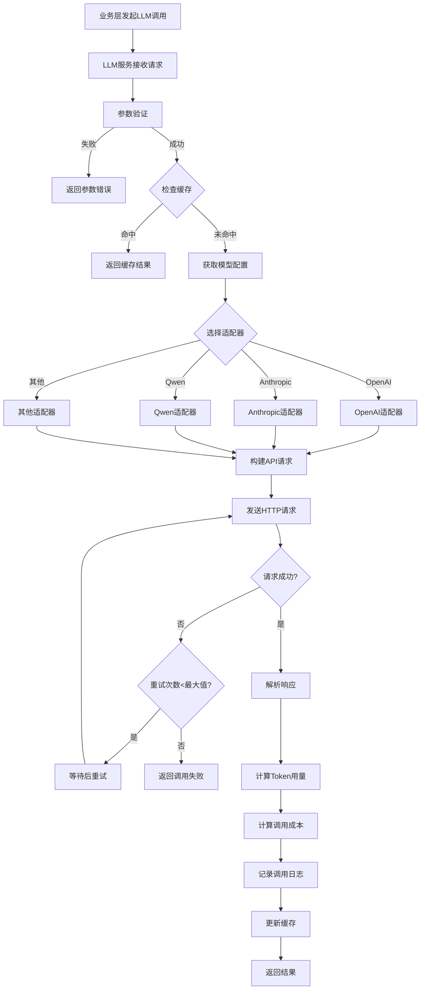

# LLM调用流程图

展示LLM调用的完整流程。

## 代码入口

| 类/函数 | 文件路径 | 说明 |
|---------|----------|------|
| `LLMService` | `src/backend/bisheng/llm/domain/services/llm.py:31` | LLM服务核心类 |
| `LLMService.get_bisheng_llm()` | `src/backend/bisheng/llm/domain/services/llm.py` | 获取LLM实例 |
| `LLMService.get_bisheng_embedding()` | `src/backend/bisheng/llm/domain/services/llm.py` | 获取Embedding实例 |
| `BishengLLM` | `src/backend/bisheng/llm/domain/llm/` | Bisheng LLM封装 |
| `BishengEmbedding` | `src/backend/bisheng/llm/domain/llm/` | Bisheng Embedding封装 |
| `LLMDao` | `src/backend/bisheng/llm/models/` | LLM数据访问 |
| `llm/api/router.py` | `src/backend/bisheng/llm/api/router.py` | LLM API路由 |

## 调用说明

### 支持的提供商

| 提供商 | 模型 |
|--------|------|
| OpenAI | GPT-3.5, GPT-4 |
| Anthropic | Claude 3 |
| 阿里云 | 通义千问 |
| 智谱AI | ChatGLM |
| 百度 | 文心一言 |
| 讯飞 | 星火大模型 |
| 自托管 | Host LLM |

### 调用参数

| 参数 | 说明 |
|------|------|
| temperature | 输出随机性 (0-2) |
| max_tokens | 最大输出token |
| top_p | 核采样参数 |
| frequency_penalty | 频率惩罚 |
| presence_penalty | 存在惩罚 |

### 重试机制

- 默认最大重试次数: 3次
- 重试间隔: 指数退避
- 可配置超时时间
