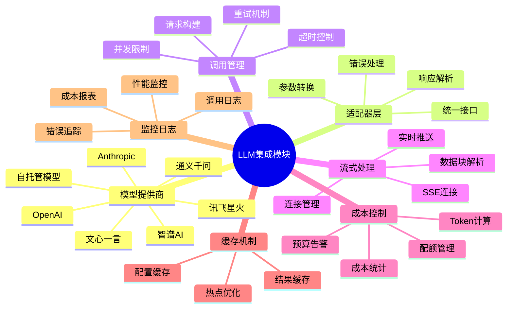

# LLM集成模块脑图

展示LLM集成模块的功能结构。

## 代码入口

| 类/函数 | 文件路径 | 说明 |
|---------|----------|------|
| `llm/` | `src/backend/bisheng/llm/` | LLM模块目录 |
| `LLMService` | `src/backend/bisheng/llm/domain/services/llm.py` | LLM服务类 |
| `BishengLLM` | `src/backend/bisheng/llm/domain/llm/` | LLM封装类 |
| `BishengEmbedding` | `src/backend/bisheng/llm/domain/llm/` | Embedding封装 |
| `BishengRerank` | `src/backend/bisheng/llm/domain/llm/rerank.py` | Rerank封装 |
| `BishengASR` | `src/backend/bisheng/llm/domain/llm/` | ASR封装 |
| `BishengTTS` | `src/backend/bisheng/llm/domain/llm/` | TTS封装 |
| `LLMDao` | `src/backend/bisheng/llm/models/` | 数据访问层 |
| `LLMModelType` | `src/backend/bisheng/llm/const.py` | 模型类型枚举 |

## 功能说明

### 模型提供商
- **OpenAI**: GPT-3.5, GPT-4
- **Anthropic**: Claude 3系列
- **通义千问**: Qwen系列
- **智谱AI**: ChatGLM系列
- **文心一言**: ERNIE系列
- **讯飞星火**: Spark系列
- **自托管**: 私有部署模型

### 适配器层
- **统一接口**: 屏蔽提供商差异
- **参数转换**: 适配不同参数格式
- **响应解析**: 统一响应格式
- **错误处理**: 统一错误处理

### 成本控制
- **Token计算**: 统计输入输出Token
- **成本统计**: 按模型计算成本
- **配额管理**: 用户/组织配额
- **预算告警**: 超出预算告警
