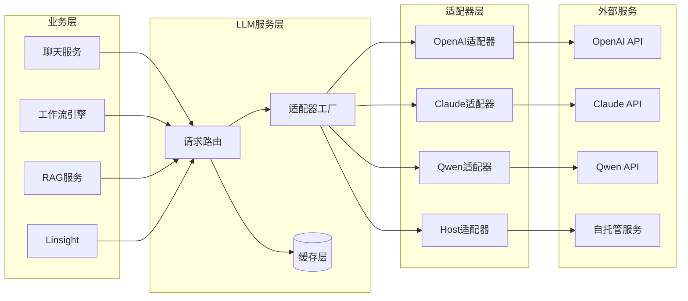

# 多模型调用数据流图

展示多模型调用的数据流转过程。

## 代码入口

| 类/函数 | 文件路径 | 说明 |
|---------|----------|------|
| `LLMService` | `src/backend/bisheng/llm/domain/services/llm.py` | LLM服务类 |
| `LLMDao` | `src/backend/bisheng/llm/models/` | 模型数据访问 |
| `LLMServer` | `src/backend/bisheng/llm/models/` | 服务提供方模型 |
| `LLMModel` | `src/backend/bisheng/llm/models/` | LLM模型配置 |
| `LLMModelType` | `src/backend/bisheng/llm/const.py` | 模型类型枚举 |

## 数据流说明

### 业务层调用

| 业务 | 用途 |
|------|------|
| 聊天服务 | 对话生成 |
| 工作流引擎 | 节点执行 |
| RAG服务 | 答案生成 |
| Linsight | 任务执行 |

### 适配器工厂

- 根据配置选择适配器
- 统一接口，屏蔽差异
- 支持动态切换模型

### 缓存层

- 缓存相同请求结果
- 减少重复调用
- 降低调用成本

### 外部服务

| 服务 | 说明 |
|------|------|
| OpenAI API | GPT系列模型 |
| Claude API | Claude系列模型 |
| Qwen API | 通义千问模型 |
| 自托管服务 | 私有部署模型 |
