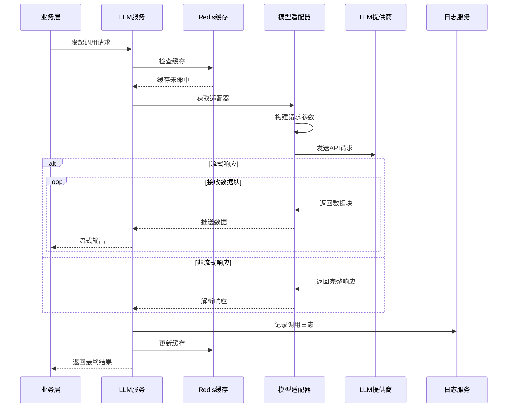

# LLM调用时序图

展示LLM调用过程中各组件的交互时序。

## 代码入口

| 类/函数 | 文件路径 | 说明 |
|---------|----------|------|
| `LLMService` | `src/backend/bisheng/llm/domain/services/llm.py` | LLM服务类 |
| `LLMService.get_all_llm()` | `src/backend/bisheng/llm/domain/services/llm.py:34` | 获取所有模型 |
| `LLMService.add_llm_server()` | `src/backend/bisheng/llm/domain/services/llm.py:66` | 添加服务提供方 |
| `LLMService.test_model_status()` | `src/backend/bisheng/llm/domain/services/llm.py:148` | 测试模型状态 |
| `LLMDao` | `src/backend/bisheng/llm/models/` | 数据访问层 |
| `LLMServer` | `src/backend/bisheng/llm/models/` | 服务提供方模型 |
| `LLMModel` | `src/backend/bisheng/llm/models/` | LLM模型配置 |

## 时序说明

### 参与组件

| 组件 | 职责 |
|------|------|
| 业务层 | 发起调用请求 |
| LLM服务 | 统一调用入口 |
| Redis缓存 | 结果缓存 |
| 模型适配器 | 适配不同提供商 |
| LLM提供商 | 实际模型服务 |
| 日志服务 | 记录调用日志 |

### 响应模式

| 模式 | 说明 |
|------|------|
| 流式响应 | 逐token返回，实时推送 |
| 非流式响应 | 等待完成后一次返回 |

### 缓存策略

- 相同请求命中缓存
- 缓存过期时间可配置
- 支持手动清除缓存
