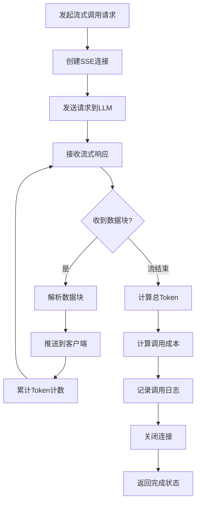

# 流式输出流程图

展示LLM流式输出的处理流程。

## 代码入口

| 类/函数 | 文件路径 | 说明 |
|---------|----------|------|
| `BishengLLM` | `src/backend/bisheng/llm/domain/llm/` | LLM封装类 |
| `LLMService` | `src/backend/bisheng/llm/domain/services/llm.py` | LLM服务 |
| `Handler.process_message()` | `src/backend/bisheng/chat/handlers.py:201` | 消息处理 |
| `process_graph()` | `src/backend/bisheng/chat/utils.py` | 图执行处理 |
| `stream_queue` | `src/backend/bisheng/chat/manager.py:93` | 流式队列 |



## 流式说明

### 流式响应优势

| 优势 | 说明 |
|------|------|
| 实时性 | 用户立即看到输出 |
| 体验好 | 打字机效果 |
| 可中断 | 支持中途停止 |

### 数据块格式

```json
{
  "id": "chatcmpl-xxx",
  "object": "chat.completion.chunk",
  "choices": [{
    "delta": {
      "content": "部分内容"
    },
    "finish_reason": null
  }]
}
```

### Token统计

- 实时累计输入Token
- 实时累计输出Token
- 流结束后计算总成本

### 错误处理

- 连接中断自动重试
- 超时自动关闭
- 错误信息推送客户端
