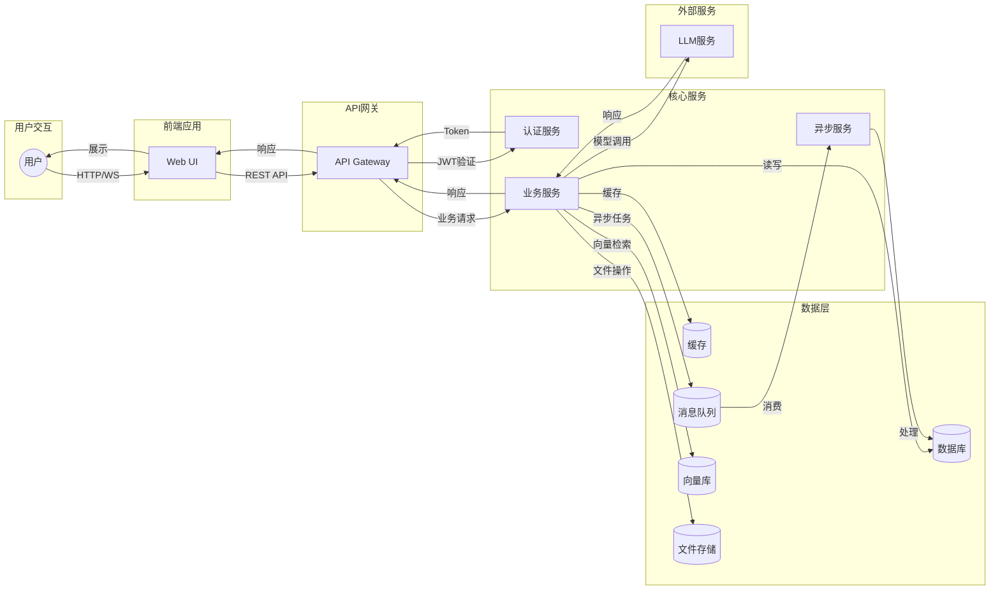

# 数据流向图

展示Bisheng平台的数据流向。

## 代码入口

| 数据流 | 相关代码 | 说明 |
|--------|----------|------|
| **API请求** | `src/backend/bisheng/api/` | REST API处理 |
| **WebSocket** | `src/backend/bisheng/chat/manager.py` | 实时消息 |
| **数据库访问** | `src/backend/bisheng/database/` | 数据持久化 |
| **缓存访问** | `src/backend/bisheng/core/cache/` | Redis缓存 |
| **向量检索** | `src/backend/bisheng/knowledge/domain/knowledge_rag.py` | 向量数据库 |
| **对象存储** | `src/backend/bisheng/core/storage/minio/` | 文件存储 |
| **异步任务** | `src/backend/bisheng/worker/` | Celery任务 |

## 数据流说明

### 同步请求流程

1. **用户发起请求** → Web UI
2. **UI发送API请求** → API Gateway
3. **Gateway验证身份** → 认证服务
4. **业务处理** → 业务服务
5. **数据操作** → 数据库/缓存
6. **返回响应** → 用户

### 异步任务流程

1. **业务服务** → 发送任务到消息队列
2. **Worker消费** → 从队列获取任务
3. **异步处理** → 执行耗时操作
4. **结果存储** → 写入数据库
5. **通知用户** → WebSocket/轮询

### 数据存储分类

| 存储类型 | 用途 | 技术 |
|----------|------|------|
| 关系数据 | 业务数据、用户数据 | MySQL |
| 缓存数据 | 会话、热点数据 | Redis |
| 向量数据 | 文档向量、检索 | Milvus |
| 文件数据 | 文档、图片 | MinIO |
| 搜索索引 | 全文检索 | Elasticsearch |
