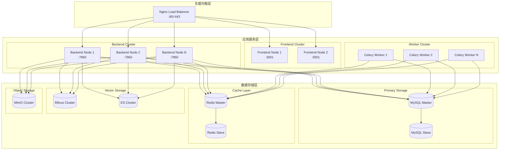

# 部署架构图

展示 Bisheng 平台的部署架构。

## 代码入口

| 配置文件 | 路径 | 说明 |
|----------|------|------|
| **Docker Compose** | `docker/docker-compose.yml` | 容器编排配置 |
| **Dockerfile** | `docker/Dockerfile` | 镜像构建配置 |
| **Nginx配置** | `docker/nginx/` | 反向代理配置 |
| **环境变量** | `.env` | 环境配置 |
| **应用配置** | `src/backend/bisheng/config.yaml` | 应用配置文件 |

## 部署说明

### 服务端口

| 服务 | 端口 | 说明 |
|------|------|------|
| Nginx | 80/443 | HTTP/HTTPS入口 |
| Backend | 7860 | 后端API服务 |
| Frontend | 3001 | 前端静态服务 |
| MySQL | 3306 | 数据库 |
| Redis | 6379 | 缓存 |
| Milvus | 19530 | 向量数据库 |
| Elasticsearch | 9200 | 搜索引擎 |
| MinIO | 9000/9001 | 对象存储 |

### 高可用配置

| 组件 | 高可用方案 |
|------|------------|
| 后端服务 | 多实例 + 负载均衡 |
| MySQL | 主从复制 |
| Redis | 主从复制 / Sentinel |
| Milvus | 集群模式 |
| MinIO | 分布式模式 |

### 扩展建议

- **水平扩展**: 增加Backend/Worker节点
- **垂直扩展**: 增加单节点资源
- **读写分离**: MySQL主从分离
- **缓存优化**: Redis集群
