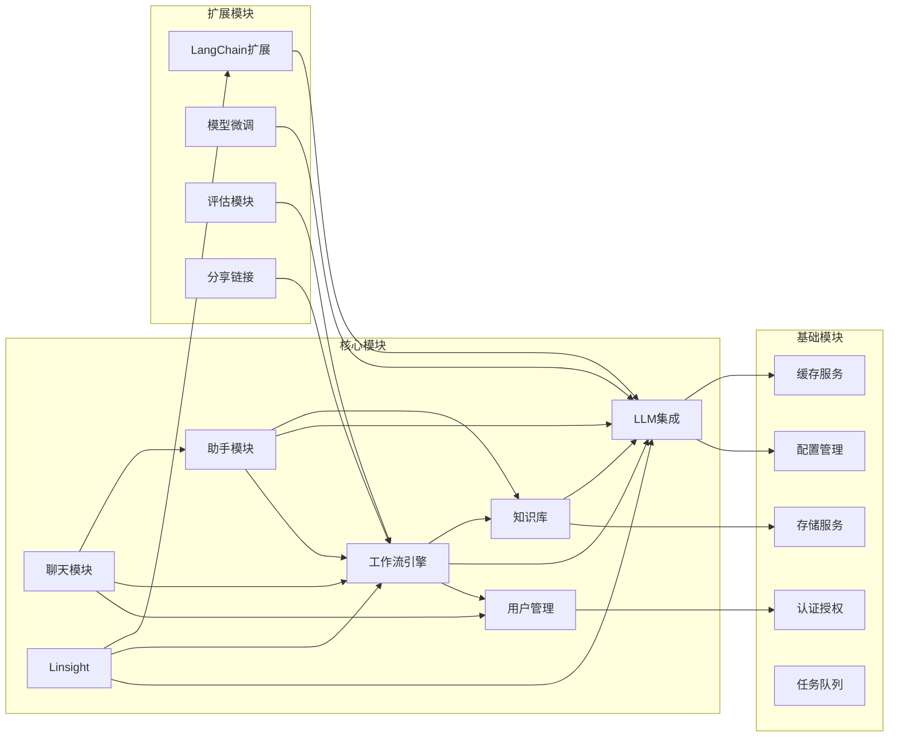

# 模块依赖关系图

展示 Bisheng 平台核心模块、基础模块、扩展模块之间的依赖关系。

## 代码入口

| 模块 | 目录 | 说明 |
|------|------|------|
| **API层** | `src/backend/bisheng/api/` | REST API和WebSocket |
| **服务层** | `src/backend/bisheng/api/services/` | 业务逻辑服务 |
| **聊天模块** | `src/backend/bisheng/chat/` | 聊天和消息处理 |
| **工作流模块** | `src/backend/bisheng/workflow/` | 工作流引擎 |
| **知识库模块** | `src/backend/bisheng/knowledge/` | 知识库管理和RAG |
| **LLM模块** | `src/backend/bisheng/llm/` | LLM集成 |
| **Linsight模块** | `src/backend/bisheng/linsight/` | Linsight Agent |
| **数据库模块** | `src/backend/bisheng/database/` | 数据模型和访问 |
| **LangChain扩展** | `src/backend/bisheng_langchain/` | LangChain扩展库 |

## 依赖说明

### 核心模块依赖

| 模块 | 依赖模块 | 说明 |
|------|----------|------|
| 用户管理 | 认证授权 | 用户认证和权限控制 |
| 工作流引擎 | 用户管理、LLM集成、知识库 | 流程执行需要用户权限、LLM调用、知识检索 |
| 知识库 | 存储服务、LLM集成 | 文档存储和向量化 |
| 聊天模块 | 用户管理、工作流引擎、助手模块 | 多种聊天类型支持 |
| LLM集成 | 配置管理、缓存服务 | 模型配置和结果缓存 |
| Linsight | LLM集成、工作流引擎、LangChain扩展 | 智能代理执行 |
| 助手模块 | 工作流引擎、LLM集成、知识库 | AI助手功能 |

### 基础模块

| 模块 | 功能 |
|------|------|
| 认证授权 | JWT Token、RBAC权限 |
| 配置管理 | 系统配置、模型配置 |
| 缓存服务 | Redis缓存 |
| 存储服务 | MinIO对象存储 |
| 任务队列 | Celery异步任务 |
