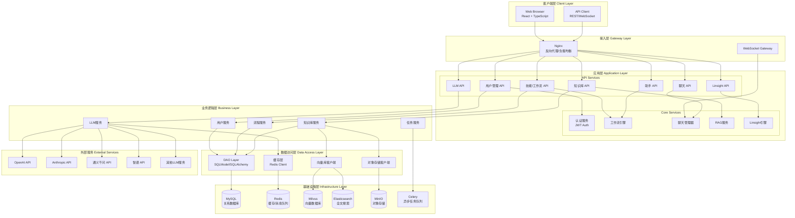

# 系统整体架构图

展示Bisheng平台的整体系统架构，包含各层级组件及其关系。

## 代码入口

| 层级 | 目录/文件 | 说明 |
|------|----------|------|
| **应用入口** | `src/backend/bisheng/main.py` | FastAPI应用入口 |
| **API层** | `src/backend/bisheng/api/` | REST API定义 |
| **服务层** | `src/backend/bisheng/api/services/` | 业务逻辑服务 |
| **数据层** | `src/backend/bisheng/database/` | 数据库模型和访问 |
| **核心模块** | `src/backend/bisheng/chat/` | 聊天模块 |
| **工作流** | `src/backend/bisheng/workflow/` | 工作流引擎 |
| **知识库** | `src/backend/bisheng/knowledge/` | 知识库模块 |
| **LLM** | `src/backend/bisheng/llm/` | LLM集成模块 |
| **Linsight** | `src/backend/bisheng/linsight/` | Linsight模块 |
| **LangChain扩展** | `src/backend/bisheng_langchain/` | LangChain扩展库 |

## 架构说明

### 分层设计

| 层级 | 职责 | 技术实现 |
|------|------|----------|
| 客户端层 | 用户界面、API调用 | React, TypeScript, Axios |
| 接入层 | 负载均衡、反向代理、WebSocket | Nginx |
| 应用层 | API接口、核心服务 | FastAPI |
| 业务逻辑层 | 业务处理、数据转换 | Python Services |
| 数据访问层 | 数据持久化、缓存 | SQLModel, Redis |
| 基础设施层 | 数据存储、消息队列 | MySQL, Redis, Milvus |
| 外部服务 | LLM模型调用 | OpenAI, Anthropic等 |
