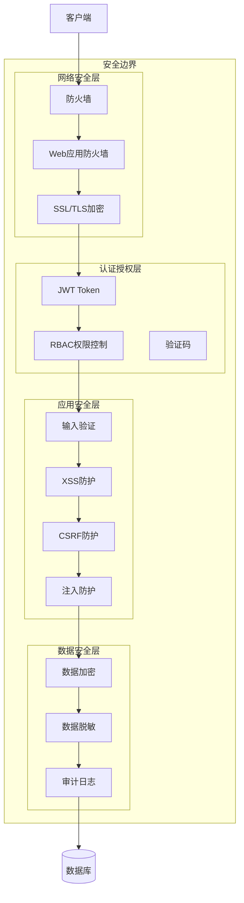

# 安全架构图

展示 Bisheng 平台的安全分层设计。

## 代码入口

| 安全模块 | 相关代码 | 说明 |
|----------|----------|------|
| **JWT认证** | `src/backend/bisheng/api/JWT.py` | JWT配置和验证 |
| **用户认证** | `src/backend/bisheng/api/services/user_service.py` | 用户登录认证 |
| **权限检查** | `src/backend/bisheng/api/services/user_service.py:81` | RBAC权限验证 |
| **角色管理** | `src/backend/bisheng/database/models/role_access.py` | 角色权限数据 |
| **密码加密** | `src/backend/bisheng/utils/` | 密码哈希处理 |
| **API限流** | `src/backend/bisheng/api/` | 请求频率限制 |

## 安全措施说明

### 网络安全

| 措施 | 说明 |
|------|------|
| 防火墙 | 网络访问控制 |
| WAF | Web应用攻击防护 |
| SSL/TLS | 传输加密 |

### 认证授权

| 措施 | 说明 |
|------|------|
| JWT Token | 无状态身份认证 |
| RBAC | 基于角色的访问控制 |
| 验证码 | 防止自动化攻击 |
| 密码策略 | 强度要求、过期策略 |

### 数据安全

| 措施 | 说明 |
|------|------|
| 数据加密 | 敏感数据加密存储 |
| 数据脱敏 | 日志和展示脱敏 |
| 审计日志 | 操作行为记录 |
| 备份恢复 | 数据备份策略 |

### 应用安全

| 措施 | 说明 |
|------|------|
| 输入验证 | 参数合法性校验 |
| XSS防护 | 跨站脚本攻击防护 |
| CSRF防护 | 跨站请求伪造防护 |
| SQL注入防护 | 参数化查询 |
