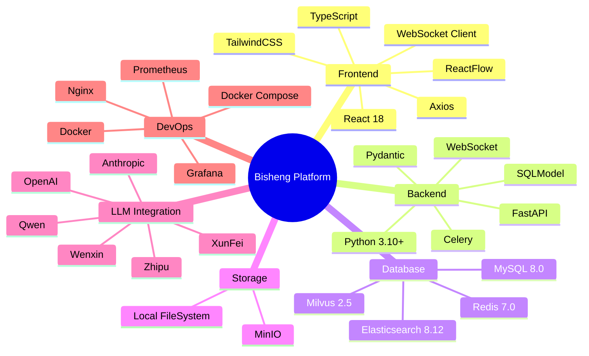

# 技术栈全景图

展示 Bisheng 平台使用的技术栈。

## 代码入口

| 技术 | 配置/入口文件 | 说明 |
|------|--------------|------|
| **FastAPI** | `src/backend/bisheng/main.py` | Web框架入口 |
| **SQLModel** | `src/backend/bisheng/database/` | ORM模型定义 |
| **Redis** | `src/backend/bisheng/core/cache/redis_manager.py` | 缓存客户端 |
| **Milvus** | `src/backend/bisheng/knowledge/rag/milvus_factory.py` | 向量库客户端 |
| **Elasticsearch** | `src/backend/bisheng/knowledge/rag/elasticsearch_factory.py` | ES客户端 |
| **MinIO** | `src/backend/bisheng/core/storage/minio/` | 对象存储客户端 |
| **Celery** | `src/backend/bisheng/worker/` | 异步任务 |
| **LangChain** | `src/backend/bisheng_langchain/` | LangChain扩展 |

## 技术栈详情

### 前端技术

| 技术 | 版本 | 用途 |
|------|------|------|
| React | 18.x | UI框架 |
| TypeScript | 5.x | 类型安全 |
| TailwindCSS | 3.x | 样式框架 |
| ReactFlow | - | 流程图编辑器 |
| Axios | - | HTTP客户端 |

### 后端技术

| 技术 | 版本 | 用途 |
|------|------|------|
| Python | 3.10+ | 编程语言 |
| FastAPI | 0.100+ | Web框架 |
| SQLModel | - | ORM |
| Pydantic | 2.x | 数据验证 |
| Celery | 5.x | 异步任务 |

### 数据存储

| 技术 | 版本 | 用途 |
|------|------|------|
| MySQL | 8.0 | 关系数据库 |
| Redis | 7.0 | 缓存/消息队列 |
| Milvus | 2.5 | 向量数据库 |
| Elasticsearch | 8.12 | 全文搜索 |
| MinIO | - | 对象存储 |

### LLM提供商

| 提供商 | 模型 |
|--------|------|
| OpenAI | GPT-3.5, GPT-4 |
| Anthropic | Claude 3 |
| 阿里云 | 通义千问 |
| 智谱AI | ChatGLM |
| 百度 | 文心一言 |
| 讯飞 | 星火大模型 |
