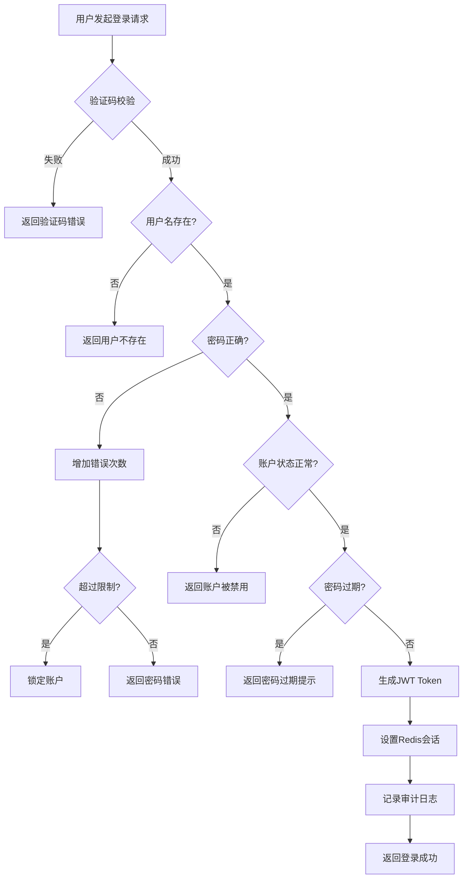

# 用户认证流程图

展示用户登录认证的完整流程。

## 代码入口

| 类/函数 | 文件路径 | 说明 |
|---------|----------|------|
| `UserPayload` | `src/backend/bisheng/api/services/user_service.py:30` | 用户负载类 |
| `get_login_user()` | `src/backend/bisheng/api/services/user_service.py` | 获取登录用户 |
| `UserDao` | `src/backend/bisheng/database/models/user.py` | 用户数据访问 |
| `UserRoleDao` | `src/backend/bisheng/database/models/user_role.py` | 用户角色数据 |
| `AuthJWT` | `fastapi_jwt_auth` | JWT认证库 |
| `user.py` | `src/backend/bisheng/api/v1/user.py` | 用户API路由 |
| `JWT.py` | `src/backend/bisheng/api/JWT.py` | JWT配置 |



## 流程说明

### 认证步骤

1. **验证码校验** - 防止自动化攻击
2. **用户名验证** - 检查用户是否存在
3. **密码验证** - 校验密码正确性
4. **错误次数控制** - 防止暴力破解
5. **账户状态检查** - 确认账户未被禁用
6. **密码过期检查** - 强制密码更新策略
7. **Token生成** - 生成JWT访问令牌
8. **会话管理** - Redis存储会话信息
9. **审计日志** - 记录登录行为

### 安全配置

```yaml
password_conf:
  login_error_time_window: 30    # 错误统计时间窗口（分钟）
  max_error_times: 5             # 最大错误次数
  password_valid_period: 90      # 密码有效期（天）
```
