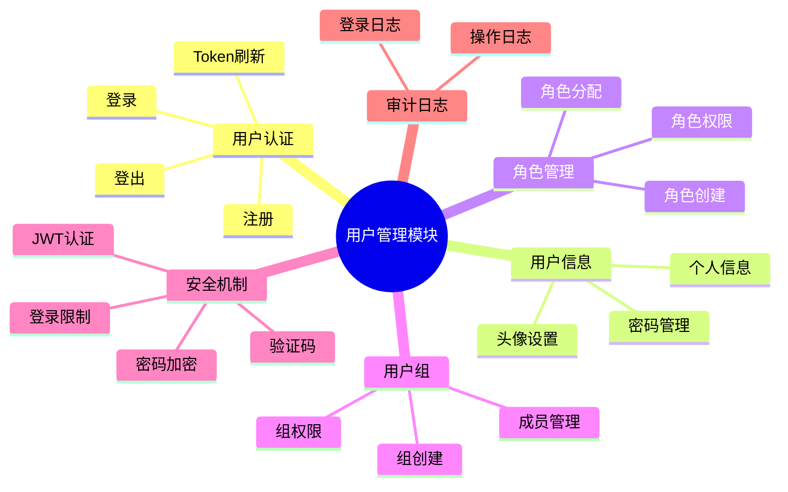

# 用户管理模块脑图

展示用户管理模块的功能结构。

## 代码入口

| 类/函数 | 文件路径 | 说明 |
|---------|----------|------|
| `UserPayload` | `src/backend/bisheng/api/services/user_service.py` | 用户负载类 |
| `UserDao` | `src/backend/bisheng/database/models/user.py` | 用户数据访问 |
| `UserRoleDao` | `src/backend/bisheng/database/models/user_role.py` | 用户角色数据 |
| `RoleAccessDao` | `src/backend/bisheng/database/models/role_access.py` | 角色权限数据 |
| `GroupDao` | `src/backend/bisheng/database/models/group.py` | 用户组数据 |
| `UserGroupDao` | `src/backend/bisheng/database/models/user_group.py` | 用户组关系 |
| `user.py` | `src/backend/bisheng/api/v1/user.py` | 用户API路由 |
| `usergroup.py` | `src/backend/bisheng/api/v1/usergroup.py` | 用户组API路由 |

## 功能说明

### 用户认证
- **登录**: 用户名密码登录，支持验证码
- **注册**: 新用户注册，首个用户自动成为管理员
- **登出**: 清除会话信息
- **Token刷新**: 自动刷新过期Token

### 角色管理
- **角色创建**: 创建自定义角色
- **角色分配**: 为用户分配角色
- **角色权限**: 配置角色的权限集合

### 安全机制
- **JWT认证**: 无状态Token认证
- **密码加密**: MD5加密存储
- **验证码**: 图形验证码防护
- **登录限制**: 错误次数限制和账户锁定
