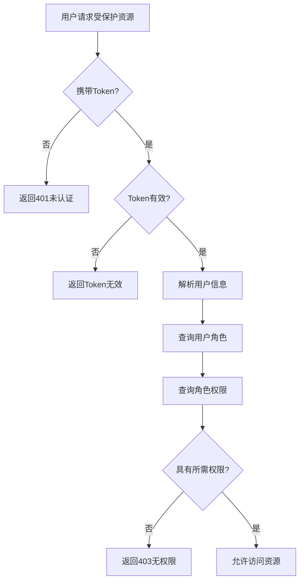

# 权限验证流程图

展示用户访问受保护资源时的权限验证流程。

## 代码入口

| 类/函数 | 文件路径 | 说明 |
|---------|----------|------|
| `UserPayload.access_check()` | `src/backend/bisheng/api/services/user_service.py:81` | 权限检查方法 |
| `RoleAccessDao` | `src/backend/bisheng/database/models/role_access.py` | 角色权限数据 |
| `AccessType` | `src/backend/bisheng/database/models/role_access.py` | 权限类型枚举 |
| `GroupDao` | `src/backend/bisheng/database/models/group.py` | 用户组数据 |
| `UserGroupDao` | `src/backend/bisheng/database/models/user_group.py` | 用户组关系 |
| `role_group_service.py` | `src/backend/bisheng/api/services/role_group_service.py` | 角色组服务 |



## 流程说明

### RBAC权限模型

```
用户(User) --> 角色(Role) --> 权限(Permission)
     |
     v
用户组(Group)
```

### 权限类型

```python
class AccessType(Enum):
    FLOW_READ = 1      # 流程读取权限
    FLOW_WRITE = 2     # 流程写入权限
    ASSISTANT_READ = 3 # 助手读取权限
    ASSISTANT_WRITE = 4 # 助手写入权限
    WORKFLOW_READ = 5  # 工作流读取权限
    WORKFLOW_WRITE = 6 # 工作流写入权限
```

### 验证步骤

1. **Token存在性检查** - 请求头是否携带Authorization
2. **Token有效性验证** - JWT签名和过期时间
3. **用户信息解析** - 从Token中提取用户ID
4. **角色查询** - 获取用户所属角色
5. **权限查询** - 获取角色拥有的权限
6. **权限匹配** - 检查是否具有所需权限
