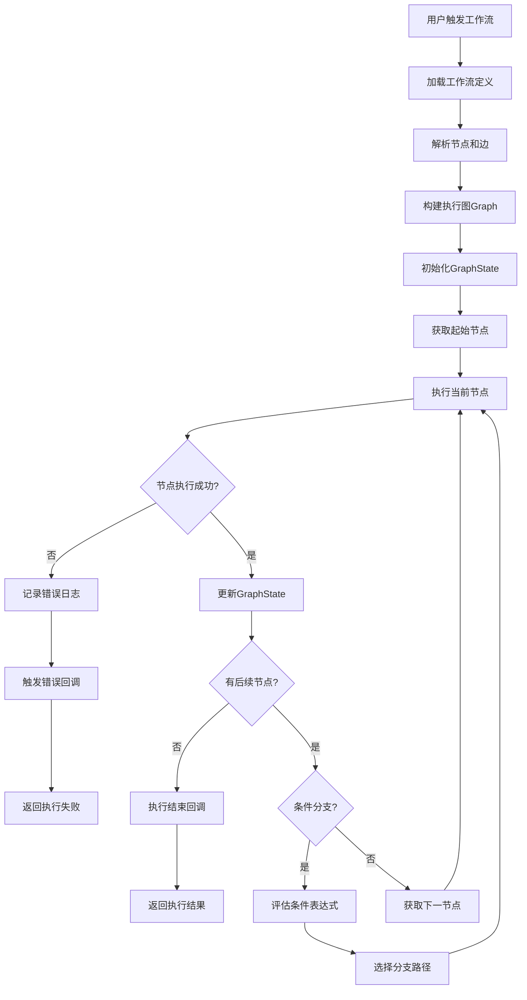

# 工作流执行流程图

展示工作流从触发到完成的执行流程。

## 代码入口

| 类/函数 | 文件路径 | 说明 |
|---------|----------|------|
| `Workflow` | `src/backend/bisheng/workflow/graph/workflow.py` | 工作流执行入口类 |
| `Workflow.run()` | `src/backend/bisheng/workflow/graph/workflow.py:48` | 同步执行入口 |
| `Workflow.arun()` | `src/backend/bisheng/workflow/graph/workflow.py:65` | 异步执行入口 |
| `GraphEngine` | `src/backend/bisheng/workflow/graph/graph_engine.py:27` | 图执行引擎核心 |
| `GraphEngine._run()` | `src/backend/bisheng/workflow/graph/graph_engine.py:285` | 执行主循环 |
| `GraphEngine.build_nodes()` | `src/backend/bisheng/workflow/graph/graph_engine.py:250` | 构建节点图 |
| `GraphState` | `src/backend/bisheng/workflow/graph/graph_state.py` | 全局状态管理 |
| `WorkflowStatus` | `src/backend/bisheng/workflow/common/workflow.py` | 工作流状态枚举 |

## 执行说明

### 执行阶段

1. **加载阶段** - 加载工作流定义JSON
2. **解析阶段** - 解析节点和边的配置
3. **构建阶段** - 构建可执行的Graph结构
4. **初始化阶段** - 初始化执行状态GraphState
5. **执行阶段** - 按顺序执行各节点
6. **完成阶段** - 汇总结果并返回

### 节点执行模式

| 模式 | 说明 |
|------|------|
| 顺序执行 | 按边的顺序依次执行 |
| 条件分支 | 根据条件选择执行路径 |
| 并行执行 | 多个节点同时执行 |
| 循环执行 | 重复执行某些节点 |

### 错误处理

- **节点错误捕获** - 单节点执行失败不影响整体
- **错误传播** - 可配置错误是否传播
- **重试机制** - 支持失败重试
- **回滚机制** - 支持状态回滚
