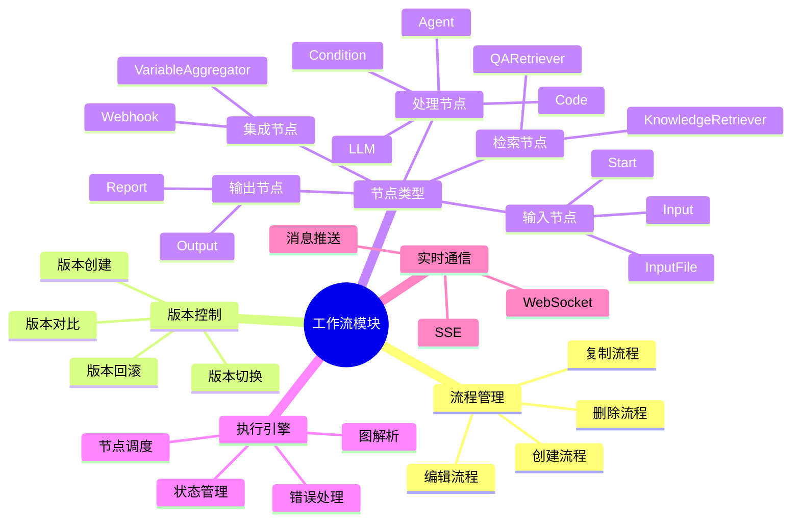

# 工作流模块脑图

展示工作流模块的功能结构。

## 代码入口

| 类/函数 | 文件路径 | 说明 |
|---------|----------|------|
| `workflow/` | `src/backend/bisheng/workflow/` | 工作流模块目录 |
| `Workflow` | `src/backend/bisheng/workflow/graph/workflow.py` | 工作流执行类 |
| `GraphEngine` | `src/backend/bisheng/workflow/graph/graph_engine.py` | 图执行引擎 |
| `GraphState` | `src/backend/bisheng/workflow/graph/graph_state.py` | 状态管理 |
| `BaseNode` | `src/backend/bisheng/workflow/nodes/base.py` | 节点基类 |
| `NodeFactory` | `src/backend/bisheng/workflow/nodes/node_manage.py` | 节点工厂 |
| `EdgeManage` | `src/backend/bisheng/workflow/edges/edges.py` | 边管理 |
| `WorkFlowService` | `src/backend/bisheng/api/services/workflow.py` | 工作流服务 |
| `FlowDao` | `src/backend/bisheng/database/models/flow.py` | 流程数据访问 |
| `FlowVersionDao` | `src/backend/bisheng/database/models/flow_version.py` | 版本数据访问 |

## 功能说明

### 流程管理
- **创建流程**: 可视化创建工作流
- **编辑流程**: 拖拽式节点编辑
- **删除流程**: 删除不需要的流程
- **复制流程**: 复制现有流程

### 版本控制
- **版本创建**: 保存当前版本
- **版本切换**: 切换到其他版本
- **版本对比**: 对比版本差异
- **版本回滚**: 回滚到历史版本

### 执行引擎
- **图解析**: 解析工作流JSON
- **状态管理**: 管理执行状态
- **节点调度**: 调度节点执行
- **错误处理**: 处理执行错误
