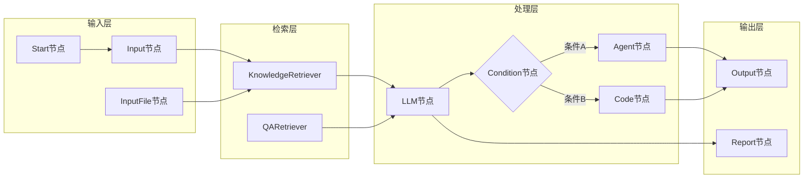

# 节点数据流图

展示工作流中不同类型节点之间的数据流转。

## 代码入口

| 类/函数 | 文件路径 | 说明 |
|---------|----------|------|
| `StartNode` | `src/backend/bisheng/workflow/nodes/start/start.py` | 开始节点 |
| `InputNode` | `src/backend/bisheng/workflow/nodes/input/input.py` | 输入节点 |
| `OutputNode` | `src/backend/bisheng/workflow/nodes/output/output.py` | 输出节点 |
| `LLMNode` | `src/backend/bisheng/workflow/nodes/llm/llm.py` | LLM节点 |
| `AgentNode` | `src/backend/bisheng/workflow/nodes/agent/agent.py` | Agent节点 |
| `CodeNode` | `src/backend/bisheng/workflow/nodes/code/code.py` | 代码节点 |
| `ConditionNode` | `src/backend/bisheng/workflow/nodes/condition/condition.py` | 条件节点 |
| `KnowledgeRetriever` | `src/backend/bisheng/workflow/nodes/knowledge_retriever/` | 知识检索节点 |
| `QARetrieverNode` | `src/backend/bisheng/workflow/nodes/qa_retriever/qa_retriever.py` | QA检索节点 |
| `EndNode` | `src/backend/bisheng/workflow/nodes/end/end.py` | 结束节点 |

## 节点类型说明

### 输入节点

| 节点 | 功能 |
|------|------|
| Start | 流程起始点 |
| Input | 用户文本输入 |
| InputFile | 用户文件上传 |

### 处理节点

| 节点 | 功能 |
|------|------|
| LLM | 大模型调用 |
| Agent | 智能代理 |
| Code | 代码执行 |
| Condition | 条件分支 |

### 检索节点

| 节点 | 功能 |
|------|------|
| KnowledgeRetriever | 知识库检索 |
| QARetriever | QA问答检索 |

### 输出节点

| 节点 | 功能 |
|------|------|
| Output | 文本输出 |
| Report | 报告生成 |

### 数据传递

- 节点间通过 `GraphState` 传递数据
- 支持变量引用和模板替换
- 支持批量数据处理
