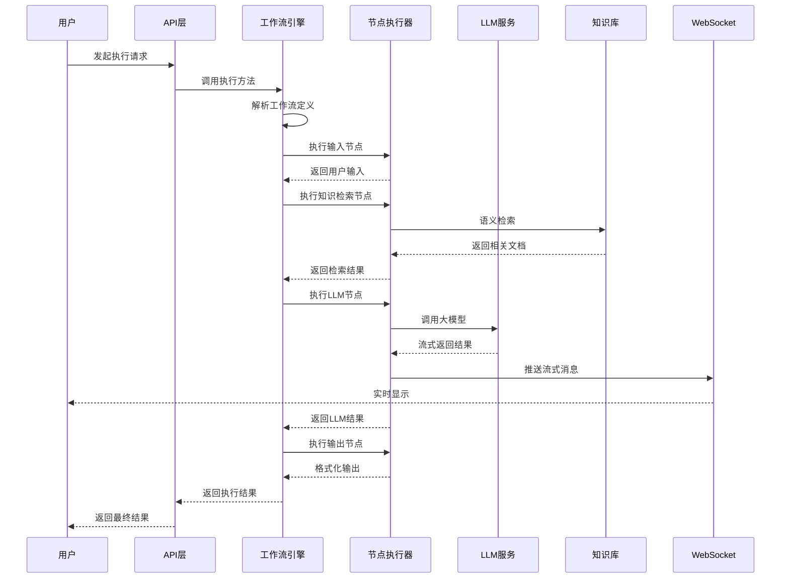

# 节点执行时序图

展示工作流节点执行过程中各组件的交互时序。

## 代码入口

| 类/函数 | 文件路径 | 说明 |
|---------|----------|------|
| `BaseNode` | `src/backend/bisheng/workflow/nodes/base.py:19` | 节点基类 |
| `BaseNode.run()` | `src/backend/bisheng/workflow/nodes/base.py:183` | 节点执行入口 |
| `BaseNode._run()` | `src/backend/bisheng/workflow/nodes/base.py:80` | 节点执行抽象方法 |
| `NodeFactory` | `src/backend/bisheng/workflow/nodes/node_manage.py:33` | 节点工厂类 |
| `NODE_CLASS_MAP` | `src/backend/bisheng/workflow/nodes/node_manage.py:16` | 节点类型映射 |
| `BaseCallback` | `src/backend/bisheng/workflow/callback/base_callback.py` | 回调处理基类 |
| `WorkFlowService.run_once()` | `src/backend/bisheng/api/services/workflow.py:111` | 单节点执行服务 |

## 时序说明

### 参与组件

| 组件 | 职责 |
|------|------|
| 用户 | 发起请求，接收结果 |
| API层 | 接收请求，返回响应 |
| 工作流引擎 | 解析和调度节点执行 |
| 节点执行器 | 执行具体节点逻辑 |
| LLM服务 | 大模型调用 |
| 知识库 | 文档检索 |
| WebSocket | 实时消息推送 |

### 执行特点

- **流式输出**: LLM结果实时推送
- **异步处理**: 耗时操作异步执行
- **状态同步**: 执行状态实时更新
