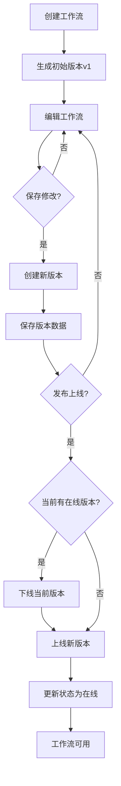

# 工作流版本管理流程图

展示工作流版本的创建、编辑和发布流程。

## 代码入口

| 类/函数 | 文件路径 | 说明 |
|---------|----------|------|
| `FlowVersionDao` | `src/backend/bisheng/database/models/flow_version.py` | 版本数据访问 |
| `FlowDao` | `src/backend/bisheng/database/models/flow.py` | 流程数据访问 |
| `WorkFlowService` | `src/backend/bisheng/api/services/workflow.py` | 工作流服务 |
| `flows.py` | `src/backend/bisheng/api/v1/flows.py` | 流程API路由 |
| `workflow.py` | `src/backend/bisheng/api/v1/workflow.py` | 工作流API路由 |

## 版本管理说明

### 版本状态

| 状态 | 值 | 说明 |
|------|-----|------|
| 草稿 | 1 | 编辑中，未发布 |
| 在线 | 2 | 已发布，可使用 |
| 下线 | 3 | 已下线，不可使用 |

### 版本命名规则

- 主版本号.次版本号.修订号（如 1.0.0）
- 支持自定义版本名称
- 自动递增版本号

### 版本操作

| 操作 | 说明 |
|------|------|
| 创建版本 | 基于当前版本创建新版本 |
| 切换版本 | 切换当前编辑的版本 |
| 版本对比 | 可视化对比两个版本差异 |
| 版本回滚 | 回滚到历史版本 |
| 版本发布 | 将版本发布上线 |
| 版本下线 | 将在线版本下线 |
